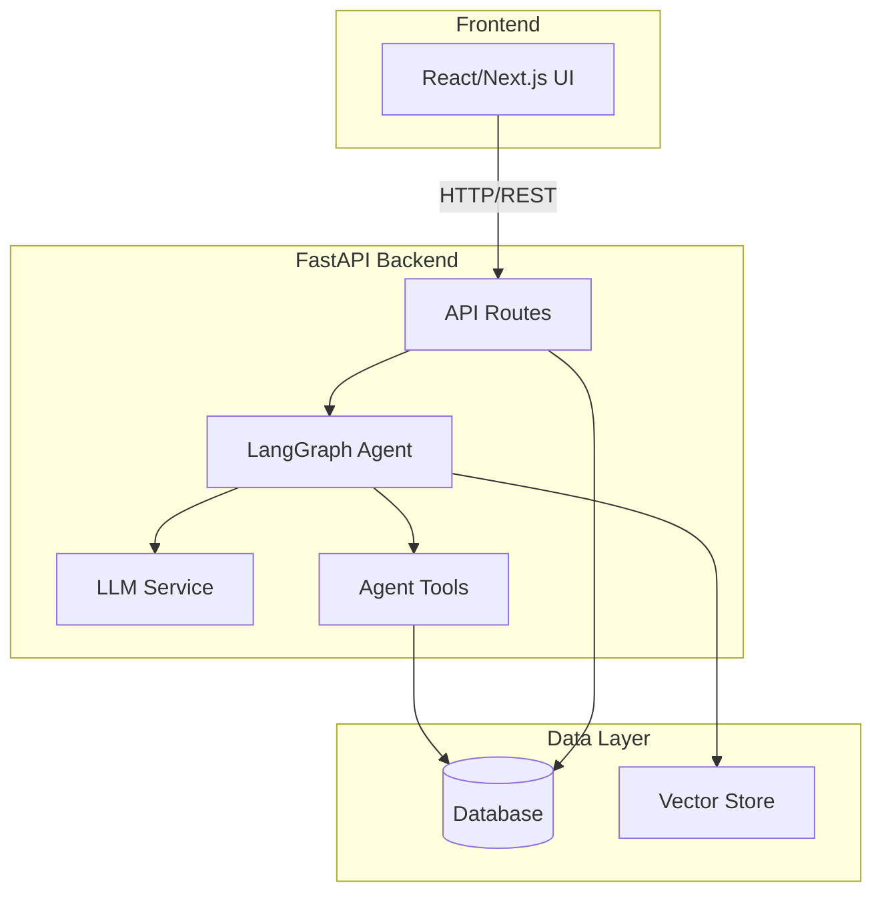
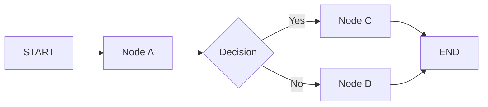
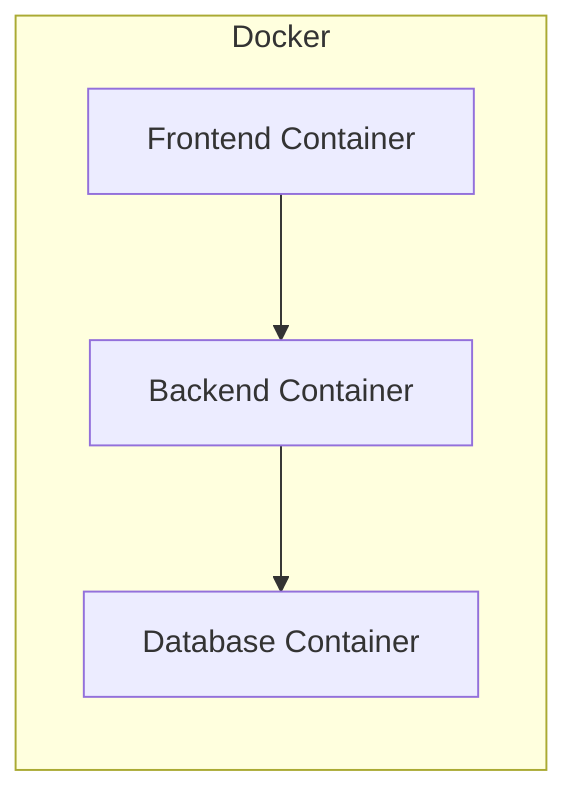

# Architecture Document

## System Overview

TeleCollect là nền tảng teleoperation & thu thập demonstration cho imitation learning: người
điều khiển lái một robot mô phỏng (MuJoCo) trực tiếp từ trình duyệt bằng bàn phím / gamepad /
chuột, trong khi hệ thống ghi lại đồng bộ luồng quan sát và hành động thành các episode
demonstration. Kiến trúc gồm frontend Next.js (giao diện teleop realtime + trình xem lại để
cắt và gắn nhãn thành công/thất bại), backend FastAPI với kênh WebSocket độ trễ thấp nối tới
lớp mô phỏng qua ROS2, và data layer lưu episode theo định dạng LeRobot/RLDS được version hoá
bằng DVC. Mọi demonstration phải qua bước reviewer duyệt (human-in-the-loop) trước khi vào
tập huấn luyện behavior cloning bằng PyTorch, và policy thu được sẽ được đánh giá success
rate ngược lại trong sim.

## Architecture Diagram

## Components

### 1. Frontend (React/Next.js)
- **Purpose:** [mô tả]
- **Key Features:** [danh sách]
- **State Management:** [approach]

### 2. Backend (FastAPI)
- **Purpose:** [mô tả]
- **API Design:** RESTful
- **Authentication:** [JWT/None]

### 3. AI Agent (LangGraph)
- **Agent Type:** [ReAct / Plan-and-Execute / Custom]
- **State:** [mô tả state schema]
- **Nodes:** [danh sách nodes]
- **Tools:** [danh sách tools]
- **Flow:**

### 4. Database
- **Type:** [PostgreSQL / SQLite]
- **Tables:** [danh sách]
- **Migrations:** Alembic

### 5. Vector Store
- **Type:** [ChromaDB / FAISS / Pinecone]
- **Embeddings:** [model]
- **Purpose:** [RAG / similarity search]

## Data Flow

1. User gửi request từ Frontend
2. API route nhận và validate input
3. Agent xử lý qua LangGraph pipeline
4. LLM generate response
5. Tools thực thi actions (nếu cần)
6. Response trả về Frontend

## Deployment Architecture

## Security

- API keys stored in `.env` (never commit)
- Input validation via Pydantic
- Rate limiting on API endpoints
- CORS configured for frontend domain

## Design Decisions

| Decision | Choice | Reason |
|----------|--------|--------|
| Framework | FastAPI | Async, auto-docs, type-safe; hỗ trợ WebSocket native cho teleop realtime |
| Agent | LangGraph | Flexible state management; điều phối pipeline duyệt demo & huấn luyện theo state machine rõ ràng |
| Database | PostgreSQL | Metadata episode/nhãn/vai trò có quan hệ chặt, cần transaction cho luồng duyệt HITL; SQLite cho dev |
| Frontend | Next.js | SSR cho trang quản lý + client component realtime; hỗ trợ tốt Gamepad API và canvas phát lại video |
| Simulator | MuJoCo | Nhẹ, tốc độ mô phỏng cao, chạy được không cần GPU nên độ trễ vòng điều khiển thấp |
| Robot middleware | ROS2 | Chuẩn công nghiệp cho truyền lệnh/quan sát, dễ đổi sang robot thật sau khi validate |
| Kênh điều khiển | WebSocket (binary) | Full-duplex, tránh overhead HTTP polling, giữ p95 latency < 100 ms |
| Định dạng dataset | LeRobot | Tương thích sẵn hệ sinh thái imitation learning, export được sang RLDS |
| Version dữ liệu | DVC | Dataset lớn không hợp với git; DVC cho phép tag từng phiên bản tập huấn luyện |
| Training | PyTorch | Behavior cloning; hệ sinh thái model robot learning phong phú |
| Lưu trữ observation | Video H.264 + parquet | Nén frame camera giảm chi phí lưu trữ; action/state để riêng dạng cột cho load nhanh |
| Deployment | Docker + GPU | Tái lập môi trường sim/train giống nhau giữa dev và CI |
