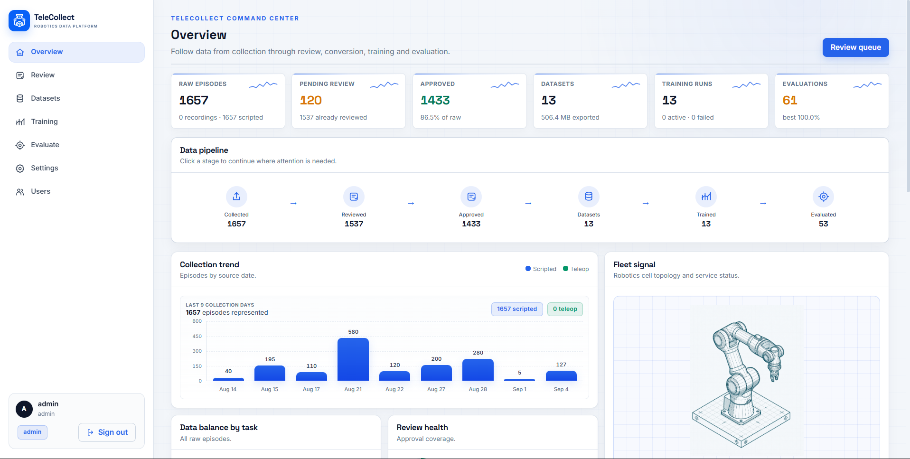
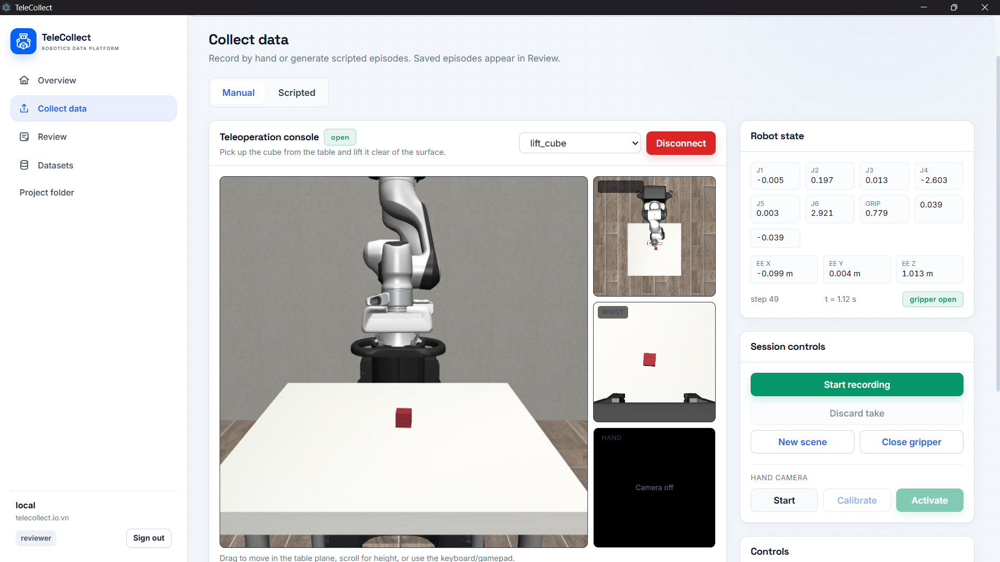
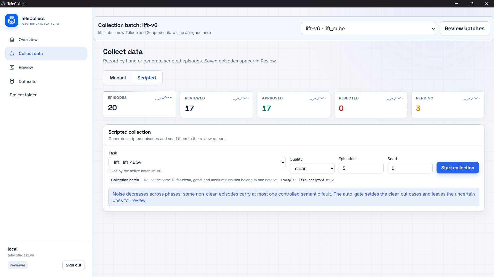
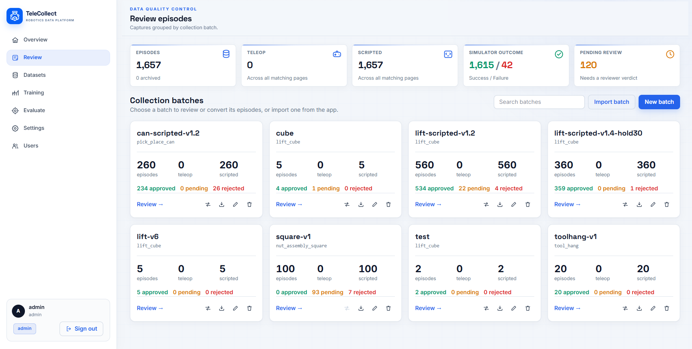
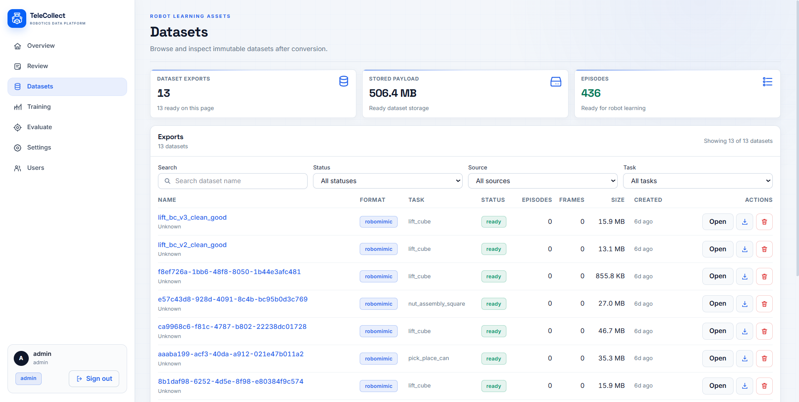
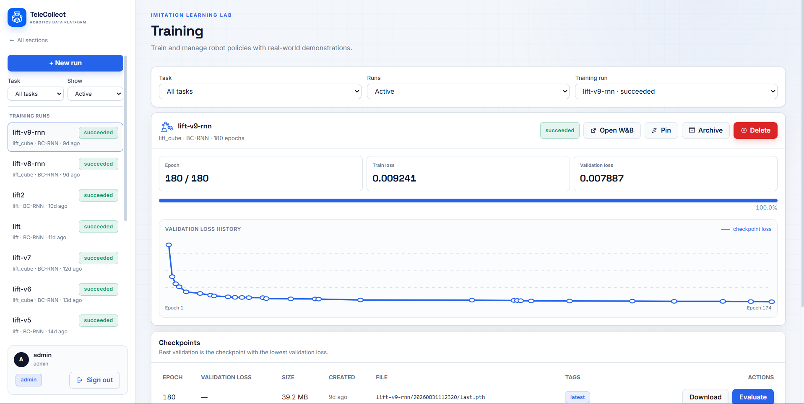
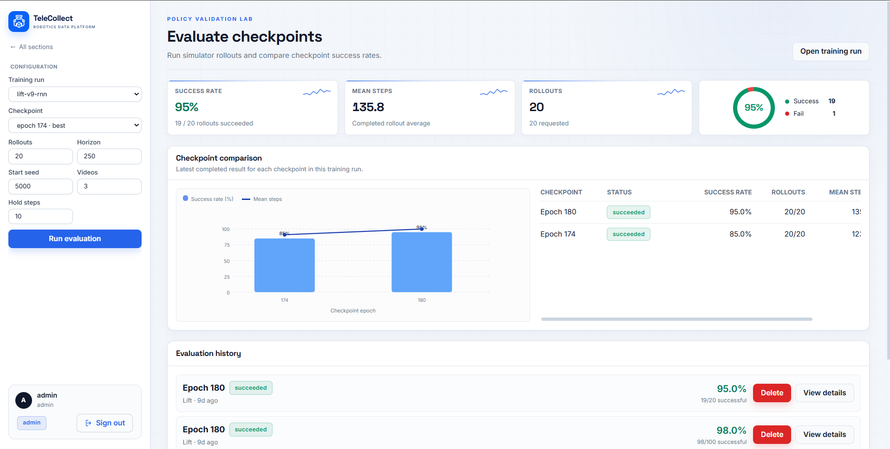

# TeleCollect Platform

TeleCollect is an end-to-end robotics data platform for imitation learning. It connects demonstration collection, quality review, dataset packaging, policy training, and simulation-based evaluation in one workflow.

The platform currently supports four robosuite/MuJoCo tasks: **Lift Cube**, **Pick and Place Can**, **Nut Assembly Square**, and **Tool Hang**.

## Demo

| Resource | Link |
| --- | --- |
| Web application | [telecollect.io.vn](https://telecollect.io.vn) |
| Windows desktop app | [Download from Google Drive](https://drive.google.com/drive/folders/1RR_behNMTDSdjDQ_tcsquJ3DFx4yJ_Y6?usp=drive_link) |
| Product demo | [Watch on YouTube](https://www.youtube.com/watch?v=eWnuH2-vsIE) |

The desktop app is designed for local data collection and can run without a separate Python or Node.js installation. Collected batches can then be pushed to the shared web platform for review, training, and evaluation.

## Product preview

### Collect once. Train anywhere.


The public landing page introduces the complete imitation-learning workflow. Its headline metrics are illustrative; authenticated dashboards display live platform data.

### Monitor the complete data pipeline



### Collect locally by hand or scripted policy

<table>
  <tr>
    <td width="50%"></td>
    <td width="50%"></td>
  </tr>
  <tr>
    <td align="center"><strong>Manual and hand-camera teleoperation</strong></td>
    <td align="center"><strong>Scripted batch collection</strong></td>
  </tr>
</table>

Manual collection combines the main scene, overhead view, wrist camera, live robot state, and optional webcam hand tracking in one console. Scripted collection generates repeatable batches with configurable task, quality profile, episode count, and seed.

### Review, package, train, and evaluate

<table>
  <tr>
    <td width="50%"></td>
    <td width="50%"></td>
  </tr>
  <tr>
    <td align="center"><strong>Quality review</strong></td>
    <td align="center"><strong>Dataset exports</strong></td>
  </tr>
  <tr>
    <td width="50%"></td>
    <td width="50%"></td>
  </tr>
  <tr>
    <td align="center"><strong>Policy training</strong></td>
    <td align="center"><strong>Simulation evaluation</strong></td>
  </tr>
</table>

## Workflow

```text
Collect -> Review -> Package -> Train -> Evaluate
```

- **Collect:** record demonstrations through keyboard/mouse or webcam hand tracking, or generate episodes with scripted policies.
- **Review:** inspect synchronized camera views, trim episodes, assign labels, and approve or reject demonstrations.
- **Package:** export approved data to RoboMimic HDF5 or LeRobot v3 datasets.
- **Train:** run Behavioral Cloning (BC) or recurrent BC (BC-RNN), monitor jobs, and track experiments with Weights & Biases.
- **Evaluate:** execute checkpoints across multiple simulation seeds and compare success rate, rollout length, and recorded videos.

A key design choice is that checkpoints are judged using task success in simulation, not validation loss alone.

## Main features

- Real-time teleoperation over WebSocket at a configurable control frequency.
- Mouse/keyboard control and MediaPipe-based webcam hand control.
- Three synchronized cameras: main review view, bird's-eye view, and wrist view.
- Scripted collection with controlled quality/noise profiles.
- Automatic quality checks with approve, reject, and human-review outcomes.
- Non-destructive trimming: original videos remain unchanged.
- Role-based access for operators, reviewers, and administrators.
- Local or RunPod-based training with per-user W&B integration.
- Offline Windows desktop collection plus a shared web workflow.
- Versioned datasets with DVC and disk-based storage for large artifacts.

## Tech stack

| Layer | Technology |
| --- | --- |
| Frontend | Next.js 16, React 19, TypeScript, Tailwind CSS 4 |
| API | FastAPI, Uvicorn, Pydantic |
| Database | SQLAlchemy Async, SQLite by default; PostgreSQL-ready configuration |
| Simulation | MuJoCo, robosuite |
| Vision and video | MediaPipe, OpenCV, PyAV, FFmpeg |
| Machine learning | PyTorch, RoboMimic, BC, BC-RNN |
| Dataset formats | RoboMimic HDF5, LeRobot v3, PyArrow, Pandas |
| Experiment tracking | Weights & Biases |
| Data versioning | DVC |
| Desktop | Electron with bundled local services |
| Deployment | Docker, Docker Compose, Caddy, HTTPS/WSS |

## Architecture

```text
Browser / Electron desktop
          |
          | REST + WebSocket
          v
Next.js frontend <-> FastAPI backend
                         |
              +----------+-----------+
              |                      |
        SQLite metadata       File-system artifacts
                              videos, datasets,
                              checkpoints, rollouts
```

The database stores metadata and references. Large files are kept under the configured storage directory and are intentionally excluded from Git.

## Requirements

For native development:

- Python 3.11 or 3.12
- Node.js 22 and npm
- FFmpeg and FFprobe available on `PATH`
- Git
- Optional: an NVIDIA GPU for faster rendering and training

Training has additional dependencies and may require a CUDA-specific PyTorch installation. Read [`requirements-train.txt`](requirements-train.txt), especially the Windows notes, before installing the training environment.

## Quick start

### 1. Clone and configure

```bash
git clone https://github.com/quangdz312/TeleCollect-Platform.git
cd TeleCollect-Platform
cp .env.example .env
```

Change `JWT_SECRET` in `.env` before exposing the application to any network. The remaining defaults are suitable for local development.

### 2. Start the backend

Create a virtual environment:

```bash
python -m venv .venv
```

Activate it in Git Bash on Windows:

```bash
source .venv/Scripts/activate
```

On Linux or macOS:

```bash
source .venv/bin/activate
```

Install dependencies, initialize the task catalog, and create an administrator:

```bash
python -m pip install --upgrade pip
pip install -r requirements.txt
python -m scripts.seed_tasks
python -m scripts.create_admin --username admin --password "Choose-A-Strong-Password"
python -m uvicorn src.main:app --reload --host 0.0.0.0 --port 8000
```

Backend endpoints:

- API: <http://localhost:8000/api/v1>
- OpenAPI documentation: <http://localhost:8000/docs>
- Health check: <http://localhost:8000/health>

### 3. Start the frontend

In a second terminal:

```bash
cd frontend
npm install
npm run dev
```

Open <http://localhost:3000> and sign in with the administrator account created above.

If the backend does not run on port 8000, create `frontend/.env.local`:

```dotenv
NEXT_PUBLIC_API_URL=http://localhost:8000
NEXT_PUBLIC_WS_BASE=ws://localhost:8000
```

## Optional sample data

For a disposable development database with sample users and demonstrations:

```bash
python -m scripts.seed_demos --reset
```

This creates development-only accounts documented in [`frontend/README.md`](frontend/README.md). Do not seed public or production deployments with these credentials.

## How to use the application

1. Sign in as an operator, reviewer, or administrator.
2. Collect a demonstration locally or generate a scripted collection batch.
3. Open **Review**, inspect the videos and quality signals, then approve, reject, label, or trim each episode.
4. Open **Datasets** and export reviewed episodes to RoboMimic or LeRobot format.
5. Open **Training**, select a dataset and configure a BC/BC-RNN run.
6. Optionally add a W&B API key under **Settings** to track metrics externally.
7. Open **Evaluate**, select a checkpoint, configure rollout seeds, and compare results and videos.

Permissions are hierarchical:

| Role | Access |
| --- | --- |
| `operator` | Collect data and view permitted recordings |
| `reviewer` | Operator access plus review, dataset, training, and evaluation workflows |
| `admin` | Reviewer access plus user and system management |

Self-registered accounts remain inactive until an administrator approves them.

## Feature flags and training

Frontend feature flags are evaluated at build time:

```dotenv
NEXT_PUBLIC_COLLECTION_ENABLED=1
NEXT_PUBLIC_TRAINING_ENABLED=true
NEXT_PUBLIC_EVALUATION_ENABLED=true
```

Backend training can run locally or through RunPod:

```dotenv
TRAINING_RUNNER=local
# TRAINING_RUNNER=runpod
# RUNPOD_API_KEY=...
# RUNPOD_ENDPOINT_ID=...
# PUBLIC_BASE_URL=https://your-domain.example
```

See [RunPod integration](docs/runpod-integration.md) for the complete setup.

Install training dependencies only on the training machine:

```bash
pip install -r requirements-train.txt
```

On Windows, follow the step-by-step CUDA and RoboMimic commands in that file instead of relying on the single command above. CPU-only installations can run the API and simulation evaluation but will train significantly slower.

## Docker

The local full-stack smoke environment exposes TeleCollect on port 8080:

```bash
docker compose -f docker-compose.local.yml build
docker compose -f docker-compose.local.yml up -d
```

Open <http://localhost:8080>. Stop the stack with:

```bash
docker compose -f docker-compose.local.yml down
```

Production deployment, HTTPS, backups, and restoration are documented in [`docs/DEPLOYMENT.md`](docs/DEPLOYMENT.md).

## Data and backups

Runtime data is stored under `data/` by default, including the SQLite database, episodes, videos, datasets, training runs, checkpoints, and evaluation rollouts. These payloads are ignored by Git because they can be many gigabytes.

Do not expect a Git clone to include collected data or trained checkpoints. Transfer or restore the data directory separately and preserve its relative structure so database references remain valid. DVC pointer files may be committed, but their payload requires access to the configured DVC remote.

## Quality checks

Run backend checks from the repository root:

```bash
python -m pytest -q
ruff check src tests
mypy src
```

Check the frontend separately:

```bash
cd frontend
npm run typecheck
npm run build
```

## Repository structure

```text
frontend/       Next.js web interface
local_app/      Electron desktop application
src/api/        REST and WebSocket endpoints
src/core/       Teleoperation sessions and recording loop
src/export/     RoboMimic and LeRobot dataset exporters
src/labeling/   Quality scoring and automatic gating
src/models/     Database models and API schemas
src/sim/        MuJoCo/robosuite environments and scripted policies
src/training/   Training and evaluation job management
scripts/        Setup, collection, import/export, training, and maintenance tools
tests/          Backend and workflow test suite
docs/           Architecture, deployment, quality, and handover documentation
```

## Documentation

| Document | Purpose |
| --- | --- |
| [Architecture](docs/ARCHITECTURE.md) | System design, components, supported tasks, and limitations |
| [Data quality](docs/DATA_QUALITY.md) | Scoring, automatic gating, labels, and noise profiles |
| [Deployment](docs/DEPLOYMENT.md) | VPS deployment, backups, and recovery |
| [RunPod integration](docs/runpod-integration.md) | Remote GPU training configuration |
| [ToolHang integration](docs/toolhang_integration.md) | Two-stage ToolHang implementation |
| [Handover](docs/HANDOVER.md) | Operational notes and known issues |
| [Weekly log](docs/weekly-log.md) | Development history and team responsibilities |

## Known limitations

- Large runtime artifacts are not distributed through Git.
- Training is disabled on CPU-only production deployments unless a local GPU or remote runner is configured.
- The project does not currently provide team-level data isolation; authorized users share the same data repository.
- FFmpeg is required for upload processing, thumbnails, and video playback.

## Project context

TeleCollect was developed by **Team NEURA** for the AI20K Build Phase Cohort 3, challenge RAV-12. Gate and phase submissions are available under [`docs/`](docs/).

## License

No open-source license has been added yet. Unless a license is provided, the repository should be treated as all rights reserved.
