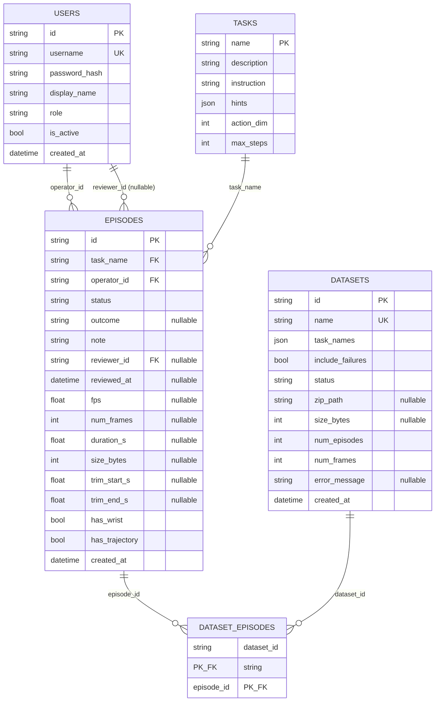
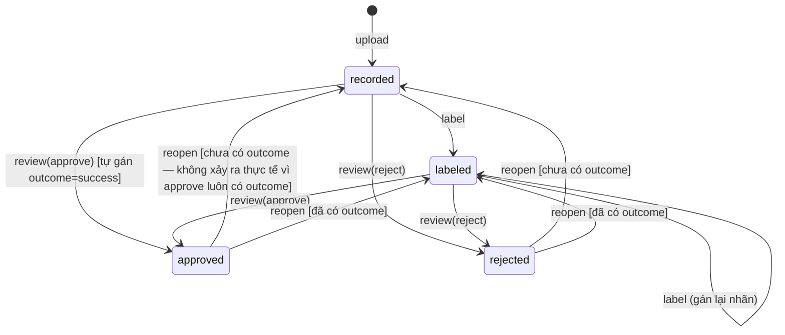

# Backend TeleCollect — Tài liệu chi tiết (bản Core, không có robot)

> Cập nhật: 2026-08-10 · Test lúc viết: **198 pass** (`python -m pytest -q`)
> Phạm vi: bản Core theo `plan_backend_core.md` — Auth/Users, Tasks, Demos (upload/xem/tua/trim/nhãn/duyệt), Datasets (đóng gói zip/tải về). Không có Teleoperation, Training/Eval, Export LeRobot/RLDS thật.

> ⚠️ **TÀI LIỆU CŨ — mô tả bản "Core, không có robot", không phải hệ thống hiện tại.**
>
> - Tiền đề "không có robot" **đã hết hiệu lực**: Teleoperation thật và scripted
>   collection (4 task, gồm ToolHang hai giai đoạn) đều đã chạy.
> - Số test **198 pass** là con số lúc viết. Hiện tại: **222 pass, 1 fail, 39
>   skipped** — lỗi `tests/test_rule_engine.py::test_can_rule_passes` đã tồn tại
>   từ trước và đang được để lại có chủ ý.
>
> Phần mô tả Auth/Users/Tasks/Demos/Datasets bên dưới **vẫn còn chính xác** và là
> lý do giữ file này. Trạng thái tổng thể: xem `README.md`.

---

## 1. Tóm tắt một phút

TeleCollect là nền tảng thu thập dữ liệu demonstration (video thao tác robot) cho imitation learning. Vì bản Core chưa nối robot/sim thật, video demo được đưa vào hệ thống qua **upload thủ công** thay vì ghi tự động từ một control loop. Từ đó, backend làm 4 việc:

1. **Auth/Users** — đăng ký/đăng nhập bằng JWT, 3 role kế thừa quyền (`operator ⊂ reviewer ⊂ admin`).
2. **Tasks** — danh mục nhiệm vụ demo (giống danh mục sản phẩm), input bắt buộc khi upload.
3. **Demos** — upload video (mp4 + optional wrist/trajectory), xem lại có tua (HTTP Range), trim, gắn nhãn success/failure, quy trình duyệt human-in-the-loop.
4. **Datasets** — gom demo đã `approved` thành một file zip bất biến (snapshot), đóng gói nền, tải về có resume.

Trạng thái: **chạy được thật**, không phải khung rỗng — 198 test pass, đã tự kiểm chứng bằng chạy server + upload/tải thật (xem mục 8 về các bug từng gặp khi chạy thật mà test không bắt được). Phần robot thật (Teleop/Training/Export) là khung rỗng có chủ đích, xem mục 11.

---

## 2. Tech stack và lý do chọn

| Công nghệ | Dùng để làm gì | Vì sao chọn |
| --- | --- | --- |
| Python 3.11 | Runtime | Yêu cầu cứng của dự án (`plan_backend_core.md`) — một số thư viện (mujoco, ...) chưa có wheel sẵn cho 3.13 lúc chốt stack. |
| FastAPI | Web framework, sinh OpenAPI tự động | Async-native, tích hợp Pydantic validate request/response miễn phí, `openapi.json` cho frontend tự sinh client thay vì đồng bộ tay. |
| SQLAlchemy 2.x (async) | ORM + query builder | API async native (`AsyncSession`) khớp với FastAPI async, tránh driver DB đồng bộ chặn event loop. |
| SQLite + aiosqlite | Database | Không cần server DB riêng cho một đội nhỏ; driver `aiosqlite` giữ tính async. Đánh đổi: SQLite khoá cả file khi ghi — ảnh hưởng trực tiếp tới thiết kế `dataset_builder.py` (mục 7). |
| Pydantic v2 + pydantic-settings | Validate request/response, đọc cấu hình từ `.env` | Validate tự động ở biên API (regex tên, giới hạn độ dài...), tách biệt code khỏi giá trị cấu hình. |
| PyJWT | Ký/giải mã access & refresh token | Chuẩn, không phụ thuộc framework, đủ cho JWT HS256 đơn giản. |
| bcrypt (trực tiếp, không qua passlib) | Băm mật khẩu | `passlib` đọc `bcrypt.__about__` và vỡ với `bcrypt>=4.1` (xem docstring đầu `src/services/security.py`) — gọi thẳng thư viện `bcrypt` tránh lệ thuộc một lớp bọc đã lỗi thời. |
| ffmpeg / ffprobe (hệ thống, không phải thư viện Python) | Đọc metadata video (`duration_s`, `fps`), sinh thumbnail | Không tin số liệu client gửi lên (dễ sai lệch với file thật) — server tự đo bằng công cụ chuẩn ngành. |
| pytest + httpx.AsyncClient | Test | `AsyncClient` với `ASGITransport` gọi thẳng app FastAPI trong bộ nhớ, không cần dựng server thật, vẫn đi qua đúng middleware/dependency injection. |
| ruff | Lint + format | Nhanh, 1 tool thay cả flake8/isort/black. Cấu hình ở `ruff.toml` (`line-length=120`, bỏ qua E501). |
| mypy | Kiểm tra kiểu tĩnh | Dùng thêm cho các chỗ dễ lẫn kiểu (vd session bind có thể là `AsyncEngine` hoặc `AsyncConnection` ở `src/api/datasets.py`, phải `assert isinstance` trước khi dùng). |

---

## 3. Bản đồ code — đọc từ đâu

### Thứ tự đọc gợi ý cho người mới

```
src/config.py
  → src/models/enums.py
  → src/models/db.py
  → src/services/security.py
  → src/api/auth.py, src/api/users.py
  → src/api/tasks.py
  → src/services/storage.py, src/services/media.py
  → src/api/demos.py
  → src/services/streaming.py, src/services/ranges.py
  → src/services/demo_rules.py
  → src/services/dataset_builder.py
  → src/api/datasets.py
```

### Bảng toàn bộ file trong `src/` và `scripts/`

| File | Trách nhiệm | Hàm/class chính |
| --- | --- | --- |
| `src/main.py` | Khởi tạo FastAPI app, CORS, lifespan (tạo thư mục data + `init_db()`), route `/health`. | `lifespan()`, `app` |
| `src/config.py` | Đọc `.env` qua `pydantic-settings`, cache bằng `lru_cache`. | `Settings`, `get_settings()`, `Settings.ensure_data_dirs()` |
| `src/models/enums.py` | Enum dùng chung API + DB (`StrEnum`). | `UserRole`, `DemoStatus`, `DemoOutcome`, `DatasetStatus`, `DatasetFormat` (chưa dùng), `JobStatus` (chưa dùng) |
| `src/models/db.py` | SQLAlchemy models, engine/session factory, `init_db()`. | `User`, `Task`, `Episode`, `Dataset`, `DatasetEpisode`, `get_engine()`, `session_factory()`, `get_session()` (FastAPI dependency), `enable_sqlite_foreign_keys()` |
| `src/models/schemas.py` | Pydantic request/response — hợp đồng API. | `DemoResponse`, `DatasetCreateRequest`, `PaginatedResponse[T]`, ... (xem mục 6) |
| `src/api/routes.py` | Gộp mọi router con dưới `/api/v1`. | `router` |
| `src/api/auth.py` | Đăng ký/đăng nhập/refresh/đổi mật khẩu. | `register()`, `login()`, `refresh()`, `me()`, `change_password()` |
| `src/api/users.py` | CRUD user — chỉ admin. | `list_users()`, `create_user()`, `update_user()`, `delete_user()`, `_self_lockout_guard()` |
| `src/api/tasks.py` | Danh mục task + thống kê theo task. | `list_tasks()`, `get_task_stats()`, `create_task()`, `update_task()` |
| `src/api/demos.py` | Upload/xem/tua/trim/nhãn/duyệt demo. | `upload_demo()`, `list_demos()`, `get_demos_summary()`, `playback_demo()`, `trim_demo()`, `review_demo()`, `delete_demo()` |
| `src/api/datasets.py` | Gom demo `approved` → dataset zip, tải về, xoá. | `create_dataset()`, `list_datasets()`, `get_dataset()`, `download_dataset()`, `delete_dataset()` |
| `src/services/security.py` | Băm mật khẩu, JWT, dependency phân quyền. | `hash_password()`, `create_access_token()`, `current_user()`, `current_user_allow_query_token()`, `require_min_role()`, `ROLE_RANK` |
| `src/services/storage.py` | Mọi đường dẫn dưới `storage_dir` gói ở một chỗ. | `episode_dir()`, `new_tmp_dir()`, `promote_tmp_to_episode()`, `dataset_zip_path()` |
| `src/services/media.py` | Bọc ffprobe/ffmpeg — đo video, sinh thumbnail. | `probe_video()`, `generate_thumbnail()`, `has_mp4_magic_bytes()` |
| `src/services/ranges.py` | Parse header HTTP `Range` (thuần Python, không phụ thuộc FastAPI). | `parse_range_header()`, `ResolvedRange`, `RangeNotSatisfiableError` |
| `src/services/streaming.py` | Trả `Response`/`StreamingResponse` theo Range — dùng chung cho playback lẫn download dataset. | `stream_file_range()` |
| `src/services/demo_rules.py` | Quy tắc chuyển trạng thái + kiểm tra sở hữu demo. | `ensure_can_modify()`, `apply_label()`, `apply_trim()`, `apply_review()`, `apply_reopen()` |
| `src/services/dataset_builder.py` | Đóng gói zip dataset chạy nền. | `build_dataset()`, `_build_zip_sync()`, `_sha256_file()` |
| `scripts/seed_tasks.py` | Seed 3 task cứng (`pick_place`, `stack`, `push`), idempotent. | `seed_tasks()` |
| `scripts/seed_demos.py` | Seed ~40 demo mẫu (video ffmpeg testsrc) đủ mọi status/outcome. | `seed_demos()` (nội bộ) |
| `scripts/create_admin.py` | Tạo/nâng quyền tài khoản admin đầu tiên — cách duy nhất có admin vì `/auth/register` luôn tạo `operator`. | `create_admin()` |

### Khung rỗng có chủ đích — vì sao vẫn giữ

| File/thư mục | Trạng thái | Vì sao giữ |
| --- | --- | --- |
| `src/api/teleop.py` | Chỉ docstring giao thức WebSocket + `APIRouter` rỗng, không route nào. | Giữ chỗ + tài liệu giao thức dự kiến, để giai đoạn robot thật code tiếp mà không phải thiết kế lại từ đầu. Router vẫn được `include_router` ở `routes.py` (không ảnh hưởng gì vì không có route). |
| `src/api/training.py` | Tương tự — chỉ docstring endpoint dự kiến. | Cùng lý do — chờ có Dataset export thật + PyTorch mới code. |
| `src/core/` | Có file `.py` thật (xem bảng chi tiết bên dưới) nhưng **chưa rà logic** — ngoài phạm vi tài liệu này vì Core không dùng tới. | Lõi vòng điều khiển teleop (control loop, recorder, session, anonymize) — theo `src/core/__init__.py`, package này cố tình không import FastAPI để chạy độc lập được cả từ script thu dữ liệu hàng loạt. |
| `src/sim/` | Có file `.py` thật (xem bảng chi tiết bên dưới) — **chưa rà logic**, ngoài phạm vi Core. | Lớp mô phỏng MuJoCo — theo `src/sim/__init__.py`, là biên giới duy nhất giữa hệ thống và bộ mô phỏng. |
| `src/training/` | Có file `.py` thật (xem bảng chi tiết bên dưới) — **chưa rà logic**, ngoài phạm vi Core. | Huấn luyện behavior cloning + đánh giá trong sim — theo `src/training/__init__.py`. |
| `src/export/` | Có file `.py` thật (xem bảng chi tiết bên dưới) — **chưa rà logic**, ngoài phạm vi Core. | Xuất demo đã duyệt sang định dạng dataset chuẩn (LeRobot/RLDS) — theo `src/export/__init__.py`. |
| `src/models/schemas.py`: `SessionResponse`, `LoopStatsResponse`, `TrainingJobResponse`, `EvalResultResponse`, `PolicyResponse` | Định nghĩa sẵn, không có endpoint nào dùng ở bản Core. | Theo `plan_backend_core.md` mục 5 — giữ hợp đồng dữ liệu sẵn cho giai đoạn sau, tránh viết lại schema từ đầu. |

**Chi tiết từng file trong 4 package trên** — liệt kê theo docstring đầu file (chưa đọc hết logic bên trong, chỉ để người đọc biết trong đó có gì):

| Package | File | Mô tả (theo docstring) |
| --- | --- | --- |
| `src/core/` | `anonymize.py` | Ẩn danh khuôn mặt trong frame trước khi lưu trữ lâu dài — đáp ứng ràng buộc dự án khi bản ghi có kèm webcam operator. |
| `src/core/` | `control_loop.py` | Vòng điều khiển realtime của một phiên teleop, chạy đúng nhịp `control_hz`. |
| `src/core/` | `recorder.py` | Ghi đồng bộ observation + action thành một episode — timestamp lấy từ thời gian mô phỏng, không phải wall clock, để tránh lệch bước giữa hai luồng dữ liệu. |
| `src/core/` | `session.py` | Quản lý vòng đời phiên teleop, thực thi trần `max_concurrent_sessions`. |
| `src/sim/` | `environment.py` | Wrapper môi trường MuJoCo — nạp model MJCF, cung cấp vòng `reset`/`step`/`observe`. |
| `src/sim/` | `kinematics.py` | Động học thuận/nghịch, dịch input người dùng (không gian Cartesian) sang lệnh khớp. |
| `src/sim/` | `render.py` | Render offscreen từ MuJoCo thành frame gửi cho frontend qua WebSocket. |
| `src/sim/` | `tasks.py` | Định nghĩa task mô phỏng và điều kiện thành công — registry dùng chung cho cả lúc thu demo lẫn lúc đánh giá policy. |
| `src/training/` | `dataset.py` | torch `Dataset` đọc dữ liệu đã export sang định dạng LeRobot thành tensor. |
| `src/training/` | `evaluate.py` | Đánh giá policy trong sim, đếm tỷ lệ episode thành công. |
| `src/training/` | `policy.py` | Mạng policy behavior cloning, ánh xạ observation sang action. |
| `src/training/` | `train.py` | Vòng huấn luyện behavior cloning, chạy như job nền, lưu checkpoint kèm thông tin xuất xứ. |
| `src/export/` | `builder.py` | Đóng băng demo đã duyệt thành một phiên bản dataset — chọn episode theo bộ lọc, áp khoảng cắt, tag bằng DVC. |
| `src/export/` | `lerobot.py` | Writer chuyển episode nội bộ sang bố cục định dạng LeRobot. |
| `src/export/` | `rlds.py` | Writer xuất sang định dạng RLDS (TFDS). |

---

## 4. Mô hình dữ liệu

### Vì sao bảng tên `episodes` nhưng route là `/demos`

Quyết định này chốt trong `plan_backend_core.md` mục 1: giữ tên bảng `episodes` để khớp thuật ngữ dùng ở phần Teleoperation sau này (một lần ghi từ robot = một "episode" trong RL/imitation learning), nhưng route API dùng `/demos` vì đó là thuật ngữ hướng người dùng cuối/reviewer ("bản ghi demo" dễ hiểu hơn "episode" với người ngoài ngành). Class ORM trong code là `Episode` (`src/models/db.py`), nhưng router là `src/api/demos.py`.

### Sơ đồ quan hệ



Nguồn: `src/models/db.py`. `DatasetEpisode` là bảng nối nhiều-nhiều, khoá chính kép `(dataset_id, episode_id)`, cả hai FK đều `ondelete="CASCADE"`. SQLite mặc định **tắt** ràng buộc khoá ngoại — hàm `enable_sqlite_foreign_keys()` bật `PRAGMA foreign_keys=ON` mỗi lần mở connection để cascade có hiệu lực thật (đã test ở `tests/test_db.py::test_cascade_delete_dataset_removes_dataset_episodes`).

**Lệch so với `plan_backend_core.md`:** cột `Dataset.num_episodes`, `num_frames`, `error_message` không có trong plan gốc (plan chỉ nói tới `status`, không mô tả chi tiết các cột phụ này) — được thêm khi code Bước 4 vì cần chỗ lưu kết quả build (số episode/frame thật sau khi zip xong, và thông báo lỗi khi `status=failed`) mà không phải parse lại `meta.json` trong zip mỗi lần trả API.

### Enum (`src/models/enums.py`)

| Enum | Giá trị | Ý nghĩa |
| --- | --- | --- |
| `UserRole` | `operator`, `reviewer`, `admin` | Kế thừa quyền: admin ⊇ reviewer ⊇ operator (xem `ROLE_RANK` mục 7). |
| `DemoStatus` | `recording` (chưa dùng ở Core — dành cho Teleop), `recorded`, `labeled`, `approved`, `rejected` | Vòng đời một demo, xem sơ đồ mục 5. |
| `DemoOutcome` | `success`, `failure` | Nhãn kết quả operator gán. |
| `DatasetStatus` | `building`, `ready`, `failed` | Trạng thái đóng gói zip chạy nền. |
| `DatasetFormat` | `lerobot`, `rlds` | **Chưa dùng ở Core** — dự phòng cho export thật giai đoạn sau (xem mục 11). **Lưu ý:** trường `"format"` ghi trong `meta.json` của dataset (mục 6.4) có giá trị `"raw"` — đây là **chuỗi hằng viết tay**, KHÔNG phải giá trị của enum này (`DatasetFormat` không có `RAW`). Hai thứ độc lập nhau, xem mục 13 (nợ kỹ thuật) để biết hướng thống nhất. |
| `JobStatus` | `pending`, `running`, `succeeded`, `failed`, `cancelled` | **Chưa dùng ở Core** — dự phòng cho Training. |

---

## 5. Vòng đời dữ liệu — từ upload tới tải dataset về

### Câu chuyện từng bước

1. **Upload** (`POST /api/v1/demos/upload`, `src/api/demos.py:upload_demo`)
   Client gửi multipart: `task_name`, file `front` (bắt buộc), `wrist`/`trajectory` (optional). Server:
   - Ghi file vào thư mục **tạm** `storage_dir/tmp/<uuid>/` theo chunk 1MB (`_save_upload_chunked`), đếm byte trong lúc ghi — vượt `settings.max_upload_mb` thì huỷ giữa chừng, trả `413`.
   - Kiểm tra magic bytes `ftyp` (không tin đuôi file/content-type — `has_mp4_magic_bytes()`, `src/services/media.py`).
2. **ffprobe lấy metadata** — `probe_video(front_path)` (`src/services/media.py`) chạy `ffprobe` (qua `subprocess.run` trong thread pool, xem mục 7/8) lấy `duration_s`, `fps`, `num_frames` từ **`front.mp4`** (không đụng `wrist.mp4`). Lỗi/timeout → `422` + dọn thư mục tạm.
3. **Sinh thumbnail** — `generate_thumbnail()` chạy `ffmpeg` lấy frame đầu thành `thumb.jpg`. Lỗi ở bước này **không** làm fail cả upload — chỉ ghi vào `warnings` trong response, vì thumbnail hỏng không phải lý do từ chối một video hợp lệ.
4. **Ghi DB rồi mới move file** — insert row `Episode` (status `recorded`) **trước**, commit xong mới `storage.promote_tmp_to_episode()` move thư mục tạm sang `episodes/<episode_id>/`. Thứ tự này để nếu insert DB lỗi thì thư mục tạm chưa từng được "công nhận" là của episode nào — dọn dẹp trong `finally` không đụng dữ liệu thật.
5. **Xem lại / tua** (`GET /api/v1/demos/{id}/playback`) — stream `front.mp4`/`wrist.mp4` qua `stream_file_range()` (mục 7), hỗ trợ HTTP Range đầy đủ.
6. **Trim** (`PATCH /api/v1/demos/{id}/trim`) — chỉ ghi `trim_start_s`/`trim_end_s` vào metadata, **không** đụng file video gốc, không re-encode. Validate `0 <= trim_start_s < trim_end_s <= duration_s`.
7. **Gắn nhãn** (`PATCH /api/v1/demos/{id}/label`) — operator (hoặc reviewer trở lên) gán `outcome=success|failure` + note, chuyển status sang `labeled`.
8. **Duyệt** (`POST /api/v1/demos/{id}/review`) — reviewer trở lên approve/reject. Approve khi demo chưa có nhãn (đang `recorded`) → tự gán `outcome=success` (quy tắc "nới", xem mục 6).
9. **Gom thành dataset** (`POST /api/v1/datasets`) — chọn mọi `Episode` có `status=approved` khớp `task_names` (rỗng = mọi task) và `include_failures`. Ghi bảng `dataset_episodes` **đồng bộ ngay trong request** (snapshot lựa chọn tại thời điểm tạo) rồi trả `202` với `status=building`.
10. **Đóng gói nền** (`src/services/dataset_builder.py:build_dataset`) — chạy sau khi response đã trả, qua `BackgroundTasks`: mở session riêng, snapshot dữ liệu episode ra dataclass thuần, đóng session, zip hoá trong thread pool (`asyncio.to_thread`), đóng handle zip, mở session mới cập nhật `status=ready|failed`.
11. **Tải về** (`GET /api/v1/datasets/{id}/download`) — cùng `stream_file_range()` như playback, chỉ khác `media_type="application/zip"` — hỗ trợ resume qua Range.

### State machine `DemoStatus`



Nguồn quy tắc: `src/services/demo_rules.py`. Transition sai (vd `reopen` một demo đang `recorded`) → `409 Conflict`, không âm thầm bỏ qua (`ensure_status_in()`).

### Luồng tổng thể

```mermaid
flowchart LR
    A[Upload multipart] --> B[Ghi file vào tmp/ theo chunk]
    B --> C{Magic bytes hợp lệ?}
    C -- không --> X1[422, dọn tmp]
    C -- có --> D[ffprobe: duration/fps/num_frames]
    D -- lỗi/timeout --> X1
    D --> E[ffmpeg: sinh thumbnail best-effort]
    E --> F[Insert Episode DB, commit]
    F --> G[Move tmp -> episodes/id/]
    G --> H[status=recorded]
    H --> I[label] --> J[status=labeled]
    H --> K[review] --> L[status=approved/rejected]
    J --> K
    L --> M[POST /datasets: chọn approved khớp filter]
    M --> N[Ghi dataset_episodes đồng bộ, trả 202]
    N --> O[BackgroundTasks: zip hoá trong thread]
    O --> P[status=ready + sha256 từng file trong meta.json]
    P --> Q[GET /datasets/id/download: stream Range]
```



---

## 6. Từng module

### 6.1 Auth & Users

| Method | Path | Quyền | Input | Output | Mã lỗi |
| --- | --- | --- | --- | --- | --- |
| POST | `/api/v1/auth/register` | Public (nếu `allow_self_register=true`) | `RegisterRequest` (username, password, display_name) | `UserResponse` (201) | 403 (tắt register), 409 (trùng username) |
| POST | `/api/v1/auth/login` | Public | form OAuth2 (username, password) | `TokenResponse` | 401 |
| POST | `/api/v1/auth/refresh` | Public (cần refresh token hợp lệ) | `RefreshRequest` | `TokenResponse` | 401 |
| GET | `/api/v1/auth/me` | Đã đăng nhập | — | `UserResponse` | 401 |
| PATCH | `/api/v1/auth/me/password` | Đã đăng nhập | `ChangePasswordRequest` | `UserResponse` | 401 (sai mật khẩu cũ) |
| GET | `/api/v1/users` | admin | query `role?`, `is_active?` | `list[UserResponse]` | 403 |
| POST | `/api/v1/users` | admin | `UserCreateRequest` (có chọn role) | `UserResponse` (201) | 403, 409 |
| PATCH | `/api/v1/users/{id}` | admin | `UserUpdateRequest` | `UserResponse` | 403, 404, 400 (tự hạ role/tự khoá) |
| DELETE | `/api/v1/users/{id}` | admin | — | `UserResponse` (soft delete) | 403, 404, 400 (tự xoá) |

**Quy tắc nghiệp vụ đáng nói:**
- `register` luôn ép `role=operator` — `RegisterRequest` không có field `role` nên client không thể gửi lên; muốn có admin/reviewer phải qua `POST /users` (admin) hoặc `scripts/create_admin.py`.
- `DELETE /users/{id}` là **soft delete** (`is_active=False`), không xoá cứng — vì `episodes.operator_id`/`reviewer_id` còn tham chiếu tới user, xoá cứng sẽ vỡ FK hoặc mất dấu vết ai thao tác demo nào.
- Hàm `_self_lockout_guard()` trong `src/api/users.py` chặn admin tự hạ role hoặc tự tắt `is_active` của chính mình — tránh khoá sạch quyền admin mà không ai còn quyền mở lại.

### 6.2 Tasks

| Method | Path | Quyền | Input | Output | Mã lỗi |
| --- | --- | --- | --- | --- | --- |
| GET | `/api/v1/tasks` | Đã đăng nhập | — | `list[TaskResponse]` | 401 |
| GET | `/api/v1/tasks/{name}` | Đã đăng nhập | — | `TaskResponse` | 404 |
| GET | `/api/v1/tasks/{name}/stats` | Đã đăng nhập | — | `TaskStatsResponse` | 404 |
| POST | `/api/v1/tasks` | admin | `TaskCreateRequest` | `TaskResponse` (201) | 403, 409 |
| PATCH | `/api/v1/tasks/{name}` | admin | `TaskUpdateRequest` | `TaskResponse` | 403, 404, 400 (cố đổi `name`) |

**Không có `DELETE /tasks`** — `episodes.task_name` tham chiếu tới `tasks.name`, xoá sẽ làm hỏng dữ liệu demo đã có (xem docstring đầu `src/api/tasks.py`). Muốn "ẩn" một task cần soft delete (`is_active`) ở giai đoạn sau, chưa làm.

`get_task_stats()` dùng **một query duy nhất** với conditional aggregation (`SUM(CASE WHEN ...)`) thay vì lặp COUNT theo từng status/outcome — tránh N+1 query.

### 6.3 Demos

| Method | Path | Quyền | Input | Output | Mã lỗi |
| --- | --- | --- | --- | --- | --- |
| POST | `/api/v1/demos/upload` | Đã đăng nhập | multipart: `task_name`, `front`, `wrist?`, `trajectory?` | `DemoUploadResponse` (201) | 404 (task), 413, 422 |
| GET | `/api/v1/demos` | Đã đăng nhập | query: `task`, `status`, `outcome`, `operator_id`, `mine`, `page`, `page_size` | `PaginatedResponse[DemoResponse]` | 401 |
| GET | `/api/v1/demos/summary` | Đã đăng nhập | — | `DemoSummaryResponse` | 401 |
| GET | `/api/v1/demos/{id}` | Đã đăng nhập | — | `DemoDetailResponse` | 404 |
| GET/HEAD | `/api/v1/demos/{id}/playback` | Token qua header hoặc `?token=` | query `camera=front\|wrist` | video/mp4 (Range) | 401, 404, 416 |
| GET | `/api/v1/demos/{id}/thumbnail` | Token qua header hoặc `?token=` | — | image/jpeg | 401, 404 |
| PATCH | `/api/v1/demos/{id}/trim` | Chủ sở hữu hoặc reviewer+ | `TrimRequest` | `DemoResponse` | 403, 404, 409, 422 |
| PATCH | `/api/v1/demos/{id}/label` | Chủ sở hữu hoặc reviewer+ | `LabelRequest` | `DemoResponse` | 403, 404, 409 |
| POST | `/api/v1/demos/{id}/review` | reviewer+, **không được tự duyệt demo do chính mình upload** (trừ khi `allow_self_review=true`) | `ReviewRequest` | `DemoResponse` | 403, 404, 409 |
| POST | `/api/v1/demos/{id}/reopen` | reviewer+ | — | `DemoResponse` | 403, 404, 409 |
| DELETE | `/api/v1/demos/{id}` | Chủ sở hữu hoặc reviewer+ | — | 204 | 403, 404 |

**Quy tắc nghiệp vụ:**
- `ensure_can_modify()` (`demo_rules.py`): operator chỉ sửa được demo **của chính mình**; reviewer trở lên sửa được mọi demo. Dùng cho trim/label/delete — **không** dùng cho review/reopen (2 hành động đó luôn yêu cầu role reviewer qua `require_min_role`, không xét sở hữu).
- `ensure_not_self_review()` (`demo_rules.py`): riêng cho `review` (approve **và** reject) — nếu `episode.operator_id == current_user.id` → `403 "Không thể tự duyệt demo do chính mình upload"`, đảm bảo mọi demo đã duyệt được người **khác** thẩm định. Tắt qua `settings.allow_self_review` (mặc định `false`, đặt `true` khi cần demo bằng một tài khoản). **Không áp dụng cho `reopen`** — reopen chỉ đưa demo về trạng thái trước, không tạo bảo đảm chất lượng nào nên tự reopen demo của chính mình vẫn hợp lệ.
- Route `GET /demos/summary` phải khai báo **trước** `GET /demos/{demo_id}` trong file — FastAPI khớp theo thứ tự khai báo, nếu đảo ngược thì request tới `/demos/summary` bị `/{demo_id}` "nuốt" (`demo_id="summary"` → 404).
- `DemoSummaryResponse.success_rate` = success / (success+failure) trong số **đã có nhãn**, không chia cho tổng — mẫu số = 0 thì trả `0.0`, không bao giờ `ZeroDivisionError`.

**Quyết định thiết kế đáng nói:** `trim`/`label`/`review`/`reopen` dùng chung state machine "nới" — approve một demo chưa gắn nhãn (đang `recorded`) tự gán `outcome=success` thay vì bắt buộc phải qua bước `label` riêng. Lý do (`plan_backend_core.md` §2.3): nhóm vận hành ít người, review thường do cùng một người thao tác, bắt buộc 2 bước riêng dễ khiến demo kẹt vĩnh viễn nếu quên bước label.

### 6.4 Datasets

| Method | Path | Quyền | Input | Output | Mã lỗi |
| --- | --- | --- | --- | --- | --- |
| POST | `/api/v1/datasets` | reviewer+ | `DatasetCreateRequest` (name, task_names, include_failures, overwrite) | `DatasetResponse` (202, status=building) | 403, 409, 422 |
| GET | `/api/v1/datasets` | Đã đăng nhập | `page`, `page_size` | `PaginatedResponse[DatasetResponse]` | 401 |
| GET | `/api/v1/datasets/{id}` | Đã đăng nhập | — | `DatasetDetailResponse` | 404 |
| GET | `/api/v1/datasets/{id}/download` | Token qua header hoặc `?token=` | — | application/zip (Range) | 401, 404, 409 (chưa `ready`) |
| DELETE | `/api/v1/datasets/{id}` | reviewer+ | — | 204 | 403, 404 |

**Quy tắc nghiệp vụ (`src/api/datasets.py:create_dataset`):**
- Chọn episode **trước** khi đụng tới dataset trùng tên — nếu không có demo nào khớp thì trả `422` mà **không xoá mất** dataset cũ (trường hợp `overwrite=true`). Thứ tự cố ý: validate xong mới phá huỷ dữ liệu cũ.
- Trùng `name` + `overwrite=false` → `409`; `overwrite=true` → xoá record + file zip cũ rồi tạo mới.
- Không episode nào khớp điều kiện → `422`, **không** tạo dataset rỗng.
- `name` phải khớp `^[a-z0-9][a-z0-9_-]{2,63}$` (`DATASET_NAME_PATTERN`, `src/models/schemas.py`) — vừa là thư mục gốc trong zip vừa nằm trong tên file `<name>.zip` trên đĩa, nên không được chứa khoảng trắng hay ký tự path traversal (`../evil` bị chặn ngay ở tầng Pydantic, 422).

**Lệch so với `plan_backend_core.md` — ghi rõ vì đề bài yêu cầu:**
- Plan gốc nói `meta.json` cấp dataset chứa `format` như một trường mô tả định dạng export (LeRobot/RLDS); code thật ghi cứng `"format": "raw"` (`dataset_builder.py::_build_zip_sync`) vì bản Core không có logic export sang định dạng chuẩn nào — đây chỉ là dữ liệu thô đóng gói lại, không phải LeRobot/RLDS thật. **`"raw"` là chuỗi hằng viết tay, không phải giá trị của enum `DatasetFormat`** (enum đó chỉ có `lerobot`/`rlds` — xem mục 4) — hai khái niệm hiện đang tách rời nhau, xem mục 13.
- Plan gốc nói sha256 nằm trong `meta.json` **cấp episode**; code thật ghi sha256 (theo từng file) trong `meta.json` **cấp dataset**, ở mục `episodes[].files{filename: sha256}` — `meta.json` cấp episode chỉ chứa metadata nghiệp vụ (task, outcome, trim...), không có hash. Lý do: gom hash vào một chỗ (dataset meta) giúp verify toàn bộ dataset bằng một lần đọc file, không phải mở từng `episodes/<id>/meta.json`.
- Plan gốc dùng tên field trim không thống nhất ở vài chỗ; code chốt tên `trim_start_s`/`trim_end_s` xuyên suốt DB (`Episode.trim_start_s`), API (`TrimRequest`), và `meta.json` cấp episode — không đổi tên giữa các lớp.

---

## 7. Những phần kỹ thuật đáng nói

### HTTP Range trên `/playback` và `/download`

Vì sao cần: video/zip có thể tới hàng trăm MB — không thể load cả file vào RAM mỗi request, và trình duyệt cần tua video (seek) mà không tải lại từ đầu.

`src/services/ranges.py::parse_range_header()` xử lý từng case theo RFC 7233:
- Không có header hoặc **multi-range** (`bytes=0-99,200-299`) → coi như không có Range, trả full file `200` (multi-range yêu cầu `multipart/byteranges` — không hỗ trợ, đủ dùng vì mọi trình duyệt/player thật chỉ gửi đơn-range khi tua).
- `bytes=START-END` hợp lệ, `START < total` → `206`, clamp `END` về `total-1` nếu vượt kích thước (KHÔNG trả 416 trong trường hợp này — chỉ cắt bớt).
- `bytes=START-` (open-ended) → từ `START` tới hết file.
- `bytes=-N` (suffix range) → N byte cuối file.
- `START >= total` hoặc `START > END` → raise `RangeNotSatisfiableError` → `416` kèm `Content-Range: bytes */<total>`.

`src/services/streaming.py::stream_file_range()` (dùng chung cho cả playback lẫn download) đọc file theo **chunk 1MB** (`_iter_file_range`), mở file **bên trong generator** và đóng trong `finally` — quan trọng trên Windows vì handle rò rỉ sẽ khiến `shutil.rmtree`/xoá file sau đó ném `PermissionError` (lỗi này không xảy ra trên Linux nên rất dễ lọt qua CI Linux). Có test riêng chứng minh không rò rỉ handle: `tests/test_demos_playback.py::test_episode_dir_deletable_after_streaming_no_handle_leak`.

### Xác thực qua `?token=` cho endpoint media

Thẻ `<video src="...">`/`` của trình duyệt, hoặc một link tải file trực tiếp, **không gửi được header `Authorization`**. Nếu chỉ chấp nhận Bearer token qua header, frontend buộc phải fetch nguyên file thành blob rồi mới phát/tải — với video mất luôn khả năng tua (phải tải hết mới xem), với dataset zip mất khả năng tải trực tiếp qua thanh địa chỉ trình duyệt.

Hàm `current_user_allow_query_token()` trong `src/services/security.py` chấp nhận token qua `Authorization` header **hoặc** query `?token=`, dùng cho đúng 3 endpoint: `GET /demos/{id}/playback`, `GET /demos/{id}/thumbnail`, `GET /datasets/{id}/download`.

**Đánh đổi có chủ ý:** token nằm trong URL sẽ lọt vào access log và lịch sử trình duyệt. Chấp nhận được ở bản Core (nhóm nhỏ, chưa production thật). **Hướng cải thiện sau này:** đổi sang signed URL ngắn hạn (vd pre-signed URL kiểu S3, hết hạn sau vài phút) thay vì dùng thẳng access token.

### Guardrail upload

- **Ghi theo chunk** (`_save_upload_chunked`, `src/api/demos.py`) — đọc `UploadFile` 1MB một lần qua `await upload.read(UPLOAD_CHUNK_SIZE)`, không `await upload.read()` cả file.
- **Đếm byte thật trong lúc ghi** — không tin `Content-Length` client gửi (có thể sai hoặc bị bỏ qua), vượt `settings.max_upload_mb` thì raise `UploadTooLargeError` → `413`.
- **Magic bytes thay vì content-type** — `has_mp4_magic_bytes()` đọc 8 byte đầu, kiểm tra offset 4-8 là `ftyp` (ISO base media file format). Lý do: nhiều client (curl, SDK) gửi `application/octet-stream` cho mp4 hợp lệ — chỉ check content-type sẽ chặn nhầm.
- **Thư mục tạm rồi mới commit DB** — file ghi vào `storage_dir/tmp/<uuid>/` trước, chỉ `promote_tmp_to_episode()` (move sang `episodes/<episode_id>/`) **sau khi** insert DB thành công. Đảm bảo không có file "mồ côi" nếu upload thất bại giữa chừng, và không có row DB trỏ tới file chưa tồn tại.

### RBAC có kế thừa

`ROLE_RANK: dict[UserRole, int]` trong `src/services/security.py` gán `operator=1, reviewer=2, admin=3`. `require_min_role(minimum)` so sánh **thứ hạng số**, không so khớp tên role tuyệt đối — nhờ vậy `require_min_role(UserRole.REVIEWER)` tự động cho cả `reviewer` lẫn `admin` đi qua mà không cần liệt kê danh sách role hợp lệ ở từng endpoint. Nếu so khớp tên (`user.role == "reviewer"`), thêm role `admin` sau này sẽ phải sửa lại **mọi** endpoint dùng role check.

### JWT có claim `type`, vì sao `current_user` phải query DB

Token access và refresh dùng chung hàm ký (`_create_token`) nhưng có claim `"type": "access"|"refresh"` — `_decode_typed_token()` bắt buộc đúng type, dùng nhầm refresh token cho endpoint cần access token (hoặc ngược lại) → `401` thay vì âm thầm chấp nhận.

`current_user()` **luôn query DB** theo `sub` trong payload thay vì tin thẳng nội dung token — vì một user vừa bị soft-delete (`is_active=False`) phải **mất quyền ngay lập tức**, không đợi token hết hạn (JWT là stateless, access token vẫn còn hạn dùng dù account đã khoá nếu không kiểm tra lại DB).

### Background task đóng gói zip

3 bẫy phải tránh, đều nằm trong docstring đầu `src/services/dataset_builder.py`:

1. **Session của request đã đóng khi response trả về** — `build_dataset()` không nhận `AsyncSession` mà nhận `session_factory` (đã bind sẵn engine đúng), tự mở session riêng bên trong. Endpoint (`src/api/datasets.py:create_dataset`) lấy engine từ **`session.bind`** của chính session request đang dùng, không gọi `get_engine()` trực tiếp — vì nếu gọi thẳng `get_engine()`, code sẽ tạo session trên engine app THẬT (production DB) ngay cả khi test đã override `get_session` sang engine test riêng (đây chính là bug thật gặp phải, xem mục 8).
2. **SQLite khoá file khi có transaction ghi mở** — session đầu (đọc dữ liệu episode) đóng **hẳn** trước khi bắt đầu zip hoá; session thứ hai (ghi status) chỉ mở **sau khi** zip đã đóng handle hoàn toàn.
3. **Zip là tác vụ đồng bộ nặng CPU/IO** — `_build_zip_sync()` chạy qua `await asyncio.to_thread(...)`, không chặn event loop (cùng lý do đã sửa cho `probe_video`/`generate_thumbnail`, xem mục 8).

Zip ghi ra file `.zip.tmp` trước, `Path.replace()` sang tên thật **sau khi** khối `with zipfile.ZipFile(...)` đã đóng — tránh để lại file zip dở dang nếu tiến trình chết giữa chừng, và tránh lỗi rename-khi-đang-mở-handle trên Windows.

---

## 8. Bug thật đã gặp và cách sửa

| Triệu chứng | Nguyên nhân gốc | Cách sửa | Vì sao test không bắt được |
| --- | --- | --- | --- |
| `POST /demos/upload` trả 500, traceback `NotImplementedError` tại `asyncio.create_subprocess_exec` | Trên Windows, `SelectorEventLoop` (loop mà uvicorn thật sự dùng) **không hỗ trợ subprocess** — chỉ `ProactorEventLoop` mới có. | `src/services/media.py::probe_video`/`generate_thumbnail`: bỏ hẳn `asyncio.create_subprocess_exec`, thay bằng `subprocess.run` đồng bộ chạy qua `await asyncio.to_thread(...)` — không phụ thuộc event loop policy. | `pytest-asyncio` dùng **policy mặc định** của Python trên Windows (`ProactorEventLoop`), khác hẳn loop uvicorn thật sự chạy — 160 test pass trong khi server thật chết ngay upload đầu tiên. Test hồi quy thêm sau: `tests/test_media.py` chạy `probe_video`/`generate_thumbnail` **trong một `SelectorEventLoop` tường minh** để tái hiện đúng môi trường uvicorn. |
| uvicorn log cảnh báo `Duplicate Operation ID playback_demo_..._get` | FastAPI's `generate_unique_id` mặc định tính `operationId` **một lần cho cả route** dựa trên `route.methods` (một set, không phân biệt theo từng method) — route dùng `@router.api_route(..., methods=["GET","HEAD"])` khiến cả operation GET và HEAD trong `openapi.json` nhận **cùng** `operationId`. | Tách thành 2 decorator riêng chồng lên cùng một hàm, mỗi decorator gán `operation_id` tường minh: `@router.get(..., operation_id="playback_demo")` + `@router.head(..., operation_id="playback_demo_head")` (`src/api/demos.py`). | `pytest` không tự gọi `app.openapi()` để kiểm tra spec — warning chỉ hiện khi FastAPI build OpenAPI schema (lúc mở `/docs` hoặc gọi `openapi.json`), không phải lúc chạy request bình thường. Test hồi quy: `tests/test_api/test_routes.py::test_openapi_has_no_duplicate_operation_ids` — quét **toàn bộ** `app.openapi()["paths"]`, không riêng playback. |
| Test dataset builder lỗi `sqlite3.OperationalError: no such column: datasets.num_episodes` | `background_tasks.add_task(build_dataset, dataset.id, session_factory(get_engine()))` gọi thẳng `get_engine()` — bỏ qua việc test đã override dependency `get_session` sang engine SQLite in-memory riêng. Background task vì vậy chạy trên engine **app thật** (DB file khác, schema cũ chưa có cột mới). | Lấy engine từ chính session của request: `bind = session.bind; assert isinstance(bind, AsyncEngine); build_dataset(dataset.id, session_factory(bind))` (`src/api/datasets.py:create_dataset`). | Bug này **chỉ lộ khi viết test thật cho luồng background task** (`tests/test_datasets.py`) — trước đó không ai gọi `POST /datasets` trong test nào, nên nhánh code dùng `get_engine()` chưa từng được thực thi qua `AsyncClient`. Không phải lỗi loại "test cũ bỏ sót", mà là bug bị bắt ngay trong lúc viết test mới cho tính năng mới — minh hoạ tại sao mọi endpoint mới đều cần ít nhất 1 test đi qua toàn bộ luồng thật (kể cả phần chạy nền). |
| `.env` có `DATABASE_URL` trỏ Postgres (hoặc driver chưa cài) trong khi 185 test vẫn pass | `tests/conftest.py::test_engine` **hardcode** `sqlite+aiosqlite:///:memory:`, không bao giờ đọc `settings.database_url` từ `.env` thật. Suite test vì vậy không có khả năng phát hiện driver DB thật (vd `asyncpg`) chưa được cài hoặc cấu hình sai. | Không sửa được tận gốc (conftest hardcode là chủ ý, để test không phụ thuộc máy chạy) — thêm smoke test riêng: `tests/test_config.py::test_real_settings_load_and_database_driver_is_installed` gọi `Settings()` (đọc `.env` thật, giống hệt `get_settings()` lúc server khởi động) rồi `create_async_engine(settings.database_url)` — raise `ModuleNotFoundError` ngay lập tức nếu thiếu driver, trước khi kịp connect. | Đây chính là khoảng trống: 160+ test khác dùng fixture DB riêng, không bao giờ đụng `database_url` thật — "test pass" không đồng nghĩa "server chạy được", vì hai môi trường dùng hai nguồn cấu hình khác nhau. |

---

## 9. Kiểm thử

**Tổng: 198 test** (số chính xác lấy từ `python -m pytest --collect-only -q`, tính cả biến thể `@pytest.mark.parametrize`), phân bố theo file:

| File | Số test | Trọng tâm |
| --- | --- | --- |
| `tests/test_demo_rules.py` | 31 | Unit thuần Python — transition rules + `ensure_not_self_review`, không cần DB/HTTP. Số cao hơn số hàm `def test_*` vì nhiều hàm dùng `@pytest.mark.parametrize` nhân đôi theo `start_status`. |
| `tests/test_demos_review.py` | 27 | HTTP — review/reopen/label/trim qua API, kể cả chặn tự duyệt + `allow_self_review` |
| `tests/test_ranges.py` | 21 | Unit thuần Python — parse Range header, mọi case RFC 7233 kể cả `total<=0` |
| `tests/test_auth.py` | 18 | HTTP — register/login/refresh/me/đổi mật khẩu |
| `tests/test_datasets.py` | 18 | HTTP — toàn bộ luồng dataset, kể cả mở zip thật |
| `tests/test_tasks.py` | 16 | HTTP — CRUD task + stats |
| `tests/test_demos_playback.py` | 13 | HTTP — Range trên video thật, HEAD, xoá file sau stream |
| `tests/test_users.py` | 13 | HTTP — CRUD user, self-lockout guard |
| `tests/test_demos_list.py` | 11 | HTTP — filter/phân trang/summary |
| `tests/test_db.py` | 10 | Unit + DB — model, FK cascade, unique constraint |
| `tests/test_demos_upload.py` | 9 | HTTP — guardrail upload (413, magic bytes, trajectory validate) |
| `tests/test_media.py` | 5 | Unit — ffprobe/ffmpeg, kể cả chạy trong `SelectorEventLoop` |
| `tests/test_config.py` | 4 | Unit — `Settings`, smoke test driver DB thật |
| `tests/test_api/test_routes.py` | 2 | `/health`, quét trùng `operationId` toàn spec |
| **Tổng** | **198** | |

### Chiến lược

- **Unit thuần Python** (`test_demo_rules.py`, `test_ranges.py`, `test_media.py`) — test logic tách khỏi FastAPI/DB, chạy nhanh, không cần dựng app.
- **HTTP qua `httpx.AsyncClient`** (đa số còn lại) — `ASGITransport(app=app)` gọi thẳng app trong bộ nhớ, đi qua đúng middleware + dependency injection (kể cả `BackgroundTasks`, chạy trong cùng lời gọi ASGI nên hoàn tất trước khi `await client.post(...)` trả về).

### Fixture trong `tests/conftest.py`

| Fixture | Vai trò |
| --- | --- |
| `test_engine` | Engine SQLite **in-memory** riêng mỗi test, `StaticPool` giữ đúng 1 connection (để dữ liệu `:memory:` không biến mất giữa các session trong cùng test). |
| `db_session` | Session thô để test tự chèn dữ liệu (tạo user role sẵn...) không qua HTTP. |
| `client` | `AsyncClient` override `get_session` sang `test_engine` — mọi request qua client này chạy trên DB test cô lập. |
| `storage_dir` | Override `settings.storage_dir` sang `tmp_path` — không đụng `./data/episodes` thật, không rò rỉ file giữa các test. |
| `sample_mp4_bytes` | Video mp4 thật (2s, ffmpeg `testsrc`), sinh **1 lần** (`scope="session"`), dùng lại cho mọi test upload — tránh gọi ffmpeg lặp lại tốn thời gian. |

### Test đáng chú ý

- `tests/test_demos_playback.py::test_reassembling_ranges_matches_original_file_byte_for_byte` — tải file bằng nhiều request Range 1024-byte liên tiếp, ghép lại phải **bằng đúng byte** với file gốc trên đĩa. Đây là bằng chứng "tua video" hoạt động thật, không chỉ đúng status code.
- `tests/test_media.py::test_probe_video_works_on_selector_event_loop` — chạy `probe_video()` trong `asyncio.SelectorEventLoop()` tường minh, tái hiện đúng môi trường uvicorn Windows; test này **FAIL** với code cũ (`create_subprocess_exec`) và **PASS** với code mới — đã verify bằng `git stash` code fix rồi chạy lại.
- `tests/test_datasets.py::test_built_zip_structure_and_sha256_match` — mở file zip thật bằng module `zipfile` chuẩn thư viện, parse `meta.json`, so khớp sha256 ghi trong meta với sha256 tính lại từ nội dung file thật trong zip. Test giá trị nhất của Bước 4 vì nó xác nhận file zip **dùng được thật**, không chỉ HTTP trả đúng status.
- `tests/test_api/test_routes.py::test_openapi_has_no_duplicate_operation_ids` — quét mọi `operationId` trong `app.openapi()["paths"]`, tổng quát cho **mọi** route chứ không riêng playback — bắt được lớp bug "route dùng chung method" ở bất kỳ file router nào sau này.

---

## 10. Cách chạy

Chi tiết đầy đủ xem `README.md`. Tóm tắt:

```bash
py -3.11 -m venv .venv && source .venv/Scripts/activate
python -m pip install -r requirements.txt
cp .env.example .env   # rồi đặt JWT_SECRET ngẫu nhiên

python -m uvicorn src.main:app --reload --port 8000     # chạy server
python -m scripts.create_admin --username admin --password ...
python -m scripts.seed_tasks
python -m scripts.seed_demos --reset

python -m pytest -q    # chạy test
```

### Sự cố thường gặp

| Triệu chứng | Nguyên nhân | Cách xử lý |
| --- | --- | --- |
| `sqlite3.OperationalError: no such column: ...` | Dự án chưa dùng Alembic — `init_db()` chỉ gọi `create_all`, thêm/sửa cột không tự áp dụng lên DB file đã tồn tại. | Dừng server (Windows khoá file SQLite), `rm -rf data/`, chạy lại server + 3 script seed. |
| `ModuleNotFoundError: No module named 'src'` khi chạy script | Chạy `python scripts/xxx.py` từ thư mục khác, hoặc PYTHONPATH không có gốc repo. | Cả 3 script (`create_admin.py`, `seed_tasks.py`, `seed_demos.py`) đã tự chèn gốc repo vào `sys.path` — chạy được cả `python scripts/xxx.py` lẫn `python -m scripts.xxx`. Nếu vẫn lỗi, kiểm tra đang đứng đúng thư mục gốc repo. |
| `POST /demos/upload` báo lỗi ffprobe/ffmpeg không chạy được | Thiếu `ffmpeg`/`ffprobe` trong PATH hệ thống. | `ffprobe -version` để kiểm tra; Windows: `winget install Gyan.FFmpeg` rồi mở lại terminal. |

---

## 11. Phạm vi — cái gì chưa làm và vì sao

| Module | Trạng thái | Lý do chưa làm | Cần gì để làm |
| --- | --- | --- | --- |
| Teleoperation (`src/api/teleop.py`, `src/core/*`, `src/sim/*`) | Khung rỗng — chỉ docstring giao thức WebSocket | Cần MuJoCo/ROS2, control loop 30Hz thật, đo latency p95 < 100ms — thuộc phạm vi robot thật, chưa phải ưu tiên giai đoạn này (`plan_backend_core.md` mục 1). | Robot/sim thật để sinh input; recorder ghi episode. |
| Training/Eval (`src/api/training.py`, `src/training/*`) | Khung rỗng | Cần PyTorch + GPU + sim để evaluate policy — phụ thuộc Dataset export thật, chưa có dữ liệu robot thật để train có ý nghĩa. | Dataset export đúng định dạng chuẩn (LeRobot/RLDS) + hạ tầng GPU. |
| Export LeRobot/RLDS/DVC thật (`src/export/*`) | Khung rỗng — `Dataset` hiện chỉ đóng gói zip thô (`format="raw"`, xem mục 6.4) | Cần tích hợp thư viện định dạng chuẩn (`lerobot`, `tensorflow_datasets`) + DVC remote — chưa cần thiết khi dữ liệu vẫn là video upload tay, chưa phải dữ liệu robot thật quy mô lớn. | Quyết định format chuẩn dùng cho training; remote DVC. |

### Điểm ghép nối cho Teleop sau này (quan trọng — không phải sửa API)

Theo đúng lý do giữ tên bảng `episodes` (mục 4): khi làm Teleoperation thật, **recorder chỉ cần**:
1. Ghi file video/action vào `storage_dir/episodes/<uuid>/` theo đúng cấu trúc hiện có (`front.mp4`, `wrist.mp4` optional, `trajectory.json` optional) — dùng lại `src/services/storage.py`.
2. Insert row `Episode` đúng schema hiện có (`status=recorded`, `fps`/`num_frames`/`duration_s` tự đo hoặc lấy từ control loop).

Toàn bộ API còn lại (`GET /demos`, playback, trim, label, review, datasets...) **không cần sửa gì** — chúng chỉ đọc từ bảng `episodes`/file trên đĩa, không quan tâm nguồn gốc video là upload tay hay ghi từ robot thật.

---

## 12. Câu hỏi thường gặp

**Vì sao dùng SQLite mà không phải PostgreSQL?**
Đội nhỏ, một máy chạy dev/demo, không cần server DB riêng. `database_url` là biến cấu hình (`src/config.py`) — đổi sang Postgres chỉ cần đổi connection string + cài `asyncpg`, code không phụ thuộc cú pháp SQL riêng của SQLite (trừ `PRAGMA foreign_keys=ON` chỉ áp dụng khi URL bắt đầu bằng `sqlite`, xem `get_engine()`).

**Vì sao video demo phải upload tay, không tự sinh?**
Bản Core không có robot/sim thật đứng sau để tự ghi video (đó là việc của Teleoperation, chưa làm — xem mục 11). Upload tay là cách duy nhất đưa dữ liệu vào hệ thống ở giai đoạn này.

**Tua video hoạt động thế nào?**
Trình duyệt gửi header `Range: bytes=START-END` khi người dùng kéo thanh tua, server trả `206 Partial Content` kèm đúng đoạn byte yêu cầu (đọc theo chunk, không load cả file) — xem mục 7 phần HTTP Range.

**Nếu hai người cùng duyệt một demo thì sao?**
Không có khoá pessimistic — người review sau ghi đè `reviewer_id`/`reviewed_at`/`status` của người trước (last-write-wins). Rủi ro chấp nhận được ở quy mô nhóm nhỏ hiện tại; chưa có cơ chế phát hiện xung đột (mục 13).

**Dataset đã đóng gói mà demo gốc bị xoá thì sao?**
Không ảnh hưởng — file zip là **snapshot độc lập**, đã copy nguyên video vào bên trong lúc build (`dataset_builder.py`). `DELETE /demos/{id}` chỉ xoá row `dataset_episodes` liên kết (cascade FK), không đụng file zip đã tạo. Có test xác nhận: `tests/test_datasets.py::test_deleting_source_demo_after_ready_does_not_change_zip`.

**Vì sao chưa dùng Alembic?**
`alembic` có trong `requirements.txt` nhưng chưa cấu hình — `init_db()` chỉ gọi `Base.metadata.create_all()`, đủ cho giai đoạn phát triển nhanh với một DB file có thể xoá/tạo lại (`rm -rf data/`). Cái giá: đổi schema không tự migrate lên DB cũ (xem mục 10, bảng sự cố thường gặp) — chấp nhận được vì chưa có dữ liệu production thật cần giữ.

**Bảo mật đã làm tới đâu, còn thiếu gì?**
Đã có: JWT có claim `type` + query lại DB mỗi request (không tin token mù), bcrypt băm mật khẩu, RBAC có kế thừa, chặn path traversal ở tên file/thư mục storage, giới hạn dung lượng upload, magic bytes thay vì tin content-type. Còn thiếu: xem bảng nợ kỹ thuật ở mục 13 (token trong URL, chưa có rate limiting, chưa có audit log).

**Vì sao `Episode.outcome`/`Episode.status` trong DB là cột `String`, không phải kiểu Enum thật của SQLAlchemy?**
`src/models/db.py` khai báo `Mapped[DemoOutcome | None] = mapped_column(String(20), ...)` và tương tự cho `status` — cột lưu chuỗi thô, không dùng `sqlalchemy.Enum`. Hệ quả trực tiếp: khi đọc lại từ DB, `episode.outcome`/`episode.status` là `str` (vd `"success"`), không phải `DemoOutcome.SUCCESS`. Chỗ nào cần so sánh tập hợp (`in {...}`) phải tự ép `DemoStatus(demo.status)` trước — xem `demo_rules.py::ensure_status_in` (chỉ ép `status`, `outcome` không cần vì chỉ so sánh `==` trực tiếp). `dataset_builder.py` khi ghi `episode.outcome` ra `meta.json` cố tình **không** gọi `.value` vì giá trị đọc từ DB đã là string sẵn — từng gây bug thật (`AttributeError: 'str' object has no attribute 'value'`) khi code ban đầu giả định đó là enum member.

**Vì sao endpoint xoá user/task không xoá cứng?**
Cả hai đều là khoá ngoại được nhiều bảng khác tham chiếu (`episodes.operator_id`/`reviewer_id`, `episodes.task_name`) — xoá cứng sẽ vỡ dữ liệu lịch sử demo đã có. `User` có soft delete (`is_active`); `Task` hiện chưa có (ghi rõ trong docstring `tasks.py` là việc cần làm ở giai đoạn sau).

---

## 13. Nợ kỹ thuật đã biết

Đây là mục người review sẽ hỏi nhiều nhất — liệt kê sẵn để trả lời ngay thay vì bị bắt bí giữa buổi review.

| Vấn đề | Ảnh hưởng | Hướng xử lý | Ưu tiên |
| --- | --- | --- | --- |
| Chưa cấu hình Alembic | Đổi schema (thêm/sửa cột) không tự áp dụng lên DB file đã tồn tại — lỗi `no such column: ...` (xem mục 10). Chỉ xử lý được bằng xoá DB, mất dữ liệu. | Cấu hình `alembic init`, viết migration cho từng thay đổi schema thay vì sửa trực tiếp model rồi xoá DB. Cần làm trước khi có dữ liệu production thật muốn giữ lại. | Cao — chặn đường lên production |
| Cột enum (`Episode.status`, `Episode.outcome`, `Dataset.status`...) khai báo `String` thay vì `sqlalchemy.Enum` | Đọc từ DB ra là `str` thô, không phải enum member — dễ viết nhầm code kiểu `.value` trên một giá trị đã là string (đã xảy ra thật: `AttributeError: 'str' object has no attribute 'value'` lúc viết `dataset_builder.py`, xem mục 8/12). | Đổi sang `sqlalchemy.Enum(DemoStatus)` để SQLAlchemy tự convert 2 chiều, hoặc ít nhất thống nhất quy ước "luôn coi giá trị đọc từ ORM là string" trong toàn bộ codebase và ghi rõ trong docstring model. | Trung bình — không sai chức năng hiện tại, nhưng là bẫy tái diễn cho code mới |
| `meta.json` dataset ghi `"format": "raw"` nhưng đây không phải giá trị của enum `DatasetFormat` (`lerobot`/`rlds`) | Hai khái niệm "format" đang tồn tại độc lập, không nhất quán — dễ gây hiểu nhầm khi có người đọc `DatasetFormat` rồi tưởng `"raw"` là giá trị hợp lệ của nó. | Thêm `RAW = "raw"` vào `DatasetFormat`, hoặc bỏ hẳn field `format` khỏi `meta.json` cho tới khi có export thật sang LeRobot/RLDS. | Thấp — không gây lỗi runtime, chỉ là thiếu nhất quán tài liệu/enum |
| Token xác thực nằm trong query string (`?token=`) cho endpoint media (`playback`, `thumbnail`, `download`) | Token lọt vào access log server và lịch sử trình duyệt — rủi ro rò rỉ nếu log/lịch sử bị lộ. | Đổi sang signed URL ngắn hạn (hết hạn sau vài phút, ký riêng cho từng resource) thay vì dùng thẳng access token dài hạn. | Trung bình — chấp nhận được ở quy mô hiện tại, cần làm trước khi có dữ liệu nhạy cảm thật |
| `POST /auth/login` chưa có rate limiting | Không có giới hạn số lần thử sai mật khẩu — dễ bị brute-force username/password. | Thêm middleware/thư viện rate limit theo IP hoặc username (vd giới hạn N lần/phút), khoá tạm thời sau nhiều lần sai liên tiếp. | Cao — lỗ hổng bảo mật rõ ràng trước khi triển khai thật |
| Chưa có audit log cho thao tác nhạy cảm (xoá demo/dataset, đổi role, vô hiệu hoá user) | Không truy vết được ai đã xoá gì/đổi quyền gì và khi nào — khó điều tra khi có sự cố hoặc lạm quyền. | Thêm bảng `audit_log` (actor, action, target, timestamp) hoặc tối thiểu structured logging cho các endpoint DELETE/PATCH role-sensitive. | Trung bình |
| Review đồng thời: last-write-wins, không phát hiện xung đột (xem mục 12) | Hai reviewer duyệt cùng lúc, người sau ghi đè quyết định của người trước mà không có cảnh báo. | Thêm optimistic locking (cột `version`) hoặc kiểm tra `reviewed_at` chưa đổi trước khi ghi, trả `409` nếu phát hiện đã bị người khác duyệt trước. | Thấp — rủi ro thấp ở quy mô nhóm nhỏ hiện tại |
| `Task` chưa có soft delete (`is_active`) | Không thể "ẩn" một task khỏi danh mục mà vẫn giữ dữ liệu demo cũ tham chiếu tới nó — chỉ có thể sửa mô tả, không xoá được. | Thêm cột `Task.is_active`, lọc mặc định trong `GET /tasks`, cho phép admin bật/tắt thay vì xoá. | Thấp |
| Hook `.git/hooks/pre-push` (nộp AI log) không chạy được trên Windows | Phải push kèm `--no-verify`, bỏ qua luôn bước nộp log — không tự động hoá được yêu cầu nộp AI log của môn học. | Debug script `scripts/_pyrun.sh`/`log_antigravity.py`/`submit_log.py` trên môi trường Windows Git Bash thật, hoặc viết lại hook bằng `_pyrun.cmd` cho cmd.exe thay vì chỉ bash. | Trung bình — không ảnh hưởng chức năng backend, nhưng ảnh hưởng compliance của môn học |
| CI trigger trước đây bỏ sót nhánh feature nên chưa từng chạy — đã sửa | Nhiều commit trước đó "xanh" trên giao diện chỉ vì CI không chạy, không phải vì test pass thật. Bài học: CI không chạy đồng nghĩa test không tồn tại. | Đã sửa trigger workflow để chạy trên nhánh feature; xác minh thủ công bằng `docker build` thật (xem lịch sử review) vì org hết hạn mức Actions. | Đã xử lý phần trigger |
| CI hiện không chạy được do org hết hạn mức GitHub Actions | Không có xác nhận tự động từ CI cho các commit gần đây — không phải lỗi code. | Đang chờ admin org nâng hạn mức/khôi phục Actions; tạm thời xác minh thủ công (build Docker, chạy pytest/ruff/mypy local). | Cao — chặn xác nhận CI, không chặn merge nếu đã verify thủ công |
| `plan_backend_core.md` §2.3 mô tả sai thực tế: ghi "whitelist đuôi file/content-type: video chỉ nhận `.mp4`" nhưng code chỉ kiểm magic bytes (`has_mp4_magic_bytes`, `src/services/media.py:35-44` — chỉ so `header[4:8] == b"ftyp"`, không so brand, không có whitelist đuôi file/`Content-Type` nào ở `src/api/demos.py`) | Không phải lỗ hổng — magic bytes chặt hơn kiểm đuôi file, và là hành vi cố ý theo docstring của hàm. Nhưng plan mô tả sai khiến người đọc tưởng `.mov` (cũng có marker `ftyp`, brand `qt  `) bị chặn trong khi thực ra upload được nguyên trạng — đã xác nhận và cập nhật ở `frontend_plan.md` mục 3.10. | Đã sửa `plan_backend_core.md` §2.3 cho khớp code (không sửa code, code đang đúng ý đồ ban đầu). | Thấp — chỉ là tài liệu lệch thực tế, không phải bug |
| File `.mov` upload lên được lưu với tên `front.mp4`/`wrist.mp4` (`storage.py:26-27` hardcode tên file cố định, không theo đuôi file gốc) dù nội dung thật là container QuickTime | Không gây lỗi runtime — `ffprobe` đọc theo byte thật (không theo đuôi file), endpoint playback trả cứng `media_type="video/mp4"` (`src/api/demos.py:399`) nên trình duyệt vẫn tự nhận diện codec bên trong (H.264/AAC từ iPhone tương thích cả 2 container). Chỉ là tên file trên storage không phản ánh đúng định dạng gốc. | Chấp nhận được, không cần sửa — nếu muốn chính xác tuyệt đối, có thể lưu thêm 1 field ghi container gốc (`.mov`/`.mp4`) vào DB lúc upload, nhưng không cần thiết cho bản Core. | Thấp |
