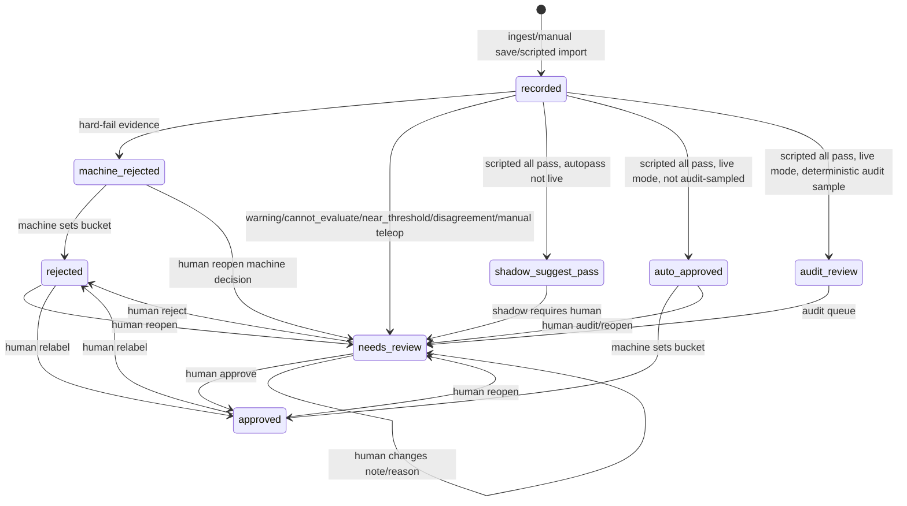

# Unified Dataset And Review-State Design

## Scope

This is a design document. It does not require production code changes in this
round. The goal is to unify manual teleop and scripted collection into one
episode index and apply the accept / review / reject policy from
`chinh-sach-de-xuat.md`.

The round-2 decision is explicit: labelled data is divided into three buckets
(`approved`, `needs_review`, `rejected`), and a user can always revisit and change
any bucket. No state is terminal.

## Current State Checked

Manual teleop currently writes artifacts under `data/episodes/<episode_id>/` and
creates an `Episode` row when the take is stopped and saved. Scripted collection is
currently outside the DB: `Workspace` reads and writes HDF5 datasets, videos,
`scores.jsonl`, and `labels.jsonl`. Dataset export currently selects
`Episode.status == APPROVED`, so scripted episodes must be imported into the DB
before they can participate in unified review and export.

The existing DB review flow is loose but reversible enough to build on:
`recorded/labeled -> approved|rejected`, with service support for reopening.

## Core Decisions

1. Create one `Episode` row for every episode, including scripted episodes.
2. Keep current on-disk layouts initially and use DB fields as the unified index:
   `source`, `artifact_format`, `artifact_uri`, `source_dataset_path`,
   `source_demo_key`, `video_uri`, and `requested_quality`.
3. Treat DB as the source of truth for current bucket/status. Keep `scores.jsonl`
   as a rebuildable scripted score cache and `labels.jsonl` as an importable
   append-only compatibility log.
4. Store machine decisions separately from human review state. A machine may set
   the initial bucket, including immediate auto-reject, but the episode remains
   listable, viewable, and re-labellable.
5. Auto-pass applies only to scripted episodes for now. Manual teleop episodes
   always enter human review because current manual recordings do not capture all
   privileged simulator state needed to independently verify policy rules.

## Data Model

Extend `Episode` rather than creating a parallel review object:

| Field | Meaning |
|---|---|
| `source` | `manual_teleop` or `scripted` |
| `artifact_format` | `teleop_dir` or `robosuite_hdf5_demo` |
| `artifact_uri` | Manual episode directory or scripted HDF5 path |
| `source_dataset_path` | Scripted HDF5 path, nullable for manual |
| `source_demo_key` | HDF5 demo key such as `demo_3`, nullable for manual |
| `video_uri` | Main playback MP4 if cached |
| `requested_quality` | Scripted quality request, nullable for manual |
| `machine_decision` | `auto_reject`, `suggest_pass`, `auto_pass`, `needs_review`, nullable before scoring |
| `machine_decision_mode` | `shadow`, `live`, or `manual_only` |
| `machine_decision_reason` | Primary rule id |
| `machine_decision_version` | Rule bundle version/hash |

Add audit tables:

| Table | Content |
|---|---|
| `episode_rule_evaluations` | One row per scorer run: `episode_id`, `task_name`, `rule_version`, `final_recommendation`, `mode`, `created_at` |
| `episode_rule_results` | One row per rule: `evaluation_id`, `rule_id`, `status`, `severity`, `measured_values`, `thresholds` |
| `episode_review_events` | Append-only human/machine events with actor, previous bucket, new bucket, reason, note, reviewer id, and timestamp |
| `task_autopass_state` | Per-task rollout state: enabled, consecutive un-overturned suggestions, target, audit rate, disabled reason, updated_at |

## State Machine

Every state has an outgoing human action. `approved` and `rejected` are buckets,
not terminal states.

`machine_rejected` may immediately set `Episode.status=REJECTED`, and
`auto_approved` may immediately set `Episode.status=APPROVED`, but neither removes
the episode from review listings or prevents later relabelling.

## Scripted UI Filters

The `/scripted` page must not filter auto-decided episodes out of existence. Replace
the current `pending / reviewed / all` filter set with bucket and source-aware
filters:

| Filter | Includes |
|---|---|
| `all` | Every scripted episode |
| `needs_review` | Human review queue, warnings, cannot-evaluate, audit samples, shadow suggestions awaiting review |
| `approved` | Human-approved plus live auto-passed episodes |
| `rejected` | Human-rejected plus auto-rejected episodes |
| `machine_auto_passed` | Episodes whose current bucket came from live auto-pass |
| `machine_auto_rejected` | Episodes whose current bucket came from auto-reject |
| `overridden` | Episodes with any human event changing a prior machine or human bucket |

`/review` should also support `source`, `task`, `bucket/status`, and
`machine_decision` filters so manual and scripted episodes are reachable through
the same review workflow.

## Override Audit Trail

Every bucket change writes an `episode_review_events` row. For a human override,
persist:

- `actor_type=user`
- `actor_id`
- `changed_at`
- `previous_bucket`
- `new_bucket`
- `previous_decision_actor` (`machine` or `user`)
- `reason_code`
- free-text `why` / note
- linked `episode_rule_evaluation_id` when overriding a machine decision

This event stream is also the signal consumed by shadow rollout. A human approval
or unchanged confirmation of a shadow `suggest_pass` increments
`consecutive_unoverturned_suggestions`; a human rejection or serious downgrade of
that suggestion resets the counter. In live mode, a serious human false-pass finding
sets `auto_pass_enabled=false` for that task.

## Rule Engine

Rules return explicit statuses:

| Status | Meaning |
|---|---|
| `pass` | The rule was evaluated and passed |
| `fail` | Hard evidence for rejection or a required condition failed |
| `cannot_evaluate` | Required state is missing; never auto-pass |
| `warning` | Risk, near-threshold result, or disagreement; route to human review |

`tau_approve` remains useful for monitoring but not for live auto-pass decisions.
Auto-pass must be based on explainable task-specific rules.

## Config Defaults

These values are defaults in configuration, not hardcoded constants.

| Config key | Default |
|---|---|
| `shadow_graduation_required` | `50` consecutive un-overturned scripted suggestions |
| `live_auto_pass_audit_rate` | `0.10` |
| `live_auto_pass_audit_sampler` | deterministic hash seeded by episode id and rule version |
| `auto_disable_serious_false_passes` | `1` |
| `stable_tail_frames` | `10` |
| `too_long_review_multiplier` | `1.5 * task median successful duration` |

## Task Threshold Defaults

Robosuite `_check_success()` was checked for the registered tasks:
`Lift:Panda`, `PickPlaceCan:Panda`, and `NutAssemblySquare:Panda`.

### Lift

Robosuite Lift success is `cube_height > table_height + 0.04`, so the delegated
`4 cm` threshold matches robosuite and is used.

| Rule | Default |
|---|---|
| Lift height | cube at least `0.04 m` above table surface; prefer robosuite value |
| Hold window | `10` consecutive frames |
| End grasp | cube still in gripper at episode end |
| Drop check | lifted object must not later fall below the lifted threshold before end |

### PickPlaceCan

Robosuite PickPlace success uses `not_in_bin(obj_pos, bin_id) == False` and requires
the gripper to be away from the object (`r_reach < 0.6`). The bin bounds come from
the environment geometry, so the rule should compute target bounds from the
robosuite env rather than duplicate fixed coordinates.

| Rule | Default |
|---|---|
| Target bounds | can center inside robosuite target bin bounds for the can |
| Divider clearance | at least `0.02 m` from the divider when geometry allows; otherwise route `cannot_evaluate`/review with measured clearance |
| At rest | linear velocity `< 0.01 m/s` for the last `10` frames |
| Release | gripper open / not carrying object at end, consistent with robosuite `r_reach < 0.6` intent |

### NutAssemblySquare

Robosuite `on_peg()` uses `abs(x error) < 0.03`, `abs(y error) < 0.03`, and object
height below `table_offset + 0.05`; `_check_success()` also requires the gripper to
be away from the nut (`r_reach < 0.6`). Because the brief says to prefer robosuite
success thresholds, use robosuite's `3 cm` x/y threshold instead of the delegated
`1 cm` position threshold. Robosuite does not define an angle threshold, so keep
the delegated `15 deg` as an additional configurable quality rule.

| Rule | Default |
|---|---|
| Position | `abs(x error) < 0.03 m` and `abs(y error) < 0.03 m`; robosuite override |
| Height | nut below `table_offset + 0.05 m`; robosuite value |
| Angle | angle error `<= 15 deg`; project default because robosuite has no angle threshold |
| Hold window | `10` frames after release |
| Release | gripper away after placement, consistent with robosuite `r_reach < 0.6` intent |

## Manual Teleop Auto-Pass

Manual teleop always routes to human review for now. To enable manual auto-pass
later, the recorder would need enough privileged state to independently evaluate
the same rules as scripted episodes: object poses and velocities, target geometry,
gripper/object contact or grasp state, simulator success, per-frame timestamps,
camera health, and task-specific environment metadata. That is only a future
recorder requirement, not part of this design round.

## Rollout Phases

1. Add schema fields/tables and migrate existing manual rows with
   `source=manual_teleop`.
2. Import scripted workspace rows into DB from `scores.jsonl` and `labels.jsonl`.
3. Move `/scripted` and `/review` listings to DB-backed bucket filters while keeping
   video rendering compatibility.
4. Implement explicit task rule registry and persist rule evaluation/result rows.
5. Enable scripted shadow suggestions and update counters from human review events.
6. Enable live scripted auto-pass with deterministic 10% audit sampling and
   auto-disable after one serious false-pass.
7. Extend dataset export to package both manual episode directories and scripted
   HDF5 demo slices.
