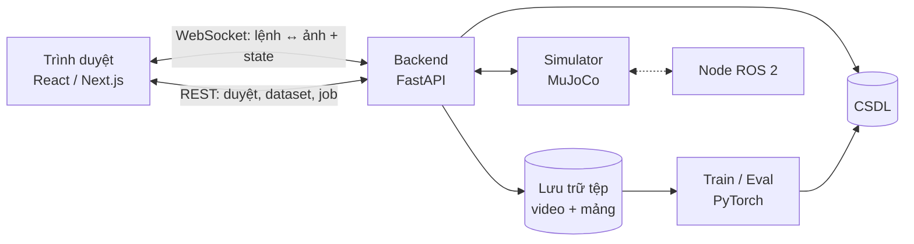
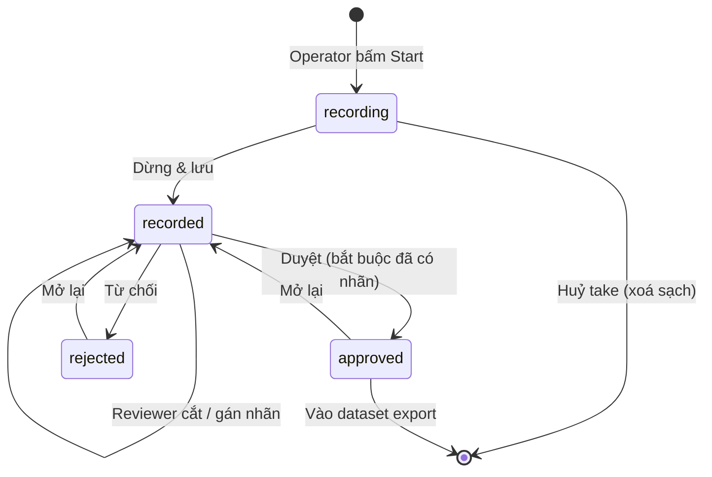

# PHẦN 2 — PRD

## 2.1 Mục tiêu sản phẩm

| #  | Mục tiêu                                                                                               |
| -- | -------------------------------------------------------------------------------------------------------- |
| G1 | Thu được demonstration**dùng được ngay** cho imitation learning, không cần xử lý thêm. |
| G2 | Mỗi mẫu huấn luyện**truy vết được** về operator đã tạo và reviewer đã duyệt nó.   |
| G3 | Điều khiển đủ mượt để con người thao tác chính xác (RTT p50 < 100 ms).                     |
| G4 | Toàn bộ chuỗi collect → review → export → train → eval chạy được**end-to-end**.         |

## 2.2 Phạm vi

| Hạng mục    | Nội dung                                                      |
| ------------- | -------------------------------------------------------------- |
| Mô phỏng    | MuJoCo, cánh tay 6 bậc tự do + gripper                      |
| Teleoperation | Trình duyệt: bàn phím / chuột,  stream 2 camera         |
| Ghi dữ liệu | Đồng bộ observation-action ở 30 Hz, nén h.264             |
| Kiểm duyệt  | Xem lại, cắt (trim), gán nhãn Success/Fail, duyệt (HITL)  |
| Phân quyền  | **≥ 2 vai trò**: Operator, Reviewer (+ Admin)          |
| Dataset       | LeRobot v2.1 và RLDS; quản lý phiên bản bằng DVC         |
| Huấn luyện  | Behavior Cloning (PyTorch), đánh giá success rate trong sim |
| Triển khai   | Docker (CPU + GPU), node ROS 2                                 |

## 2.3 Tính năng

**Ưu tiên**: P0 = không có thì sản phẩm vô nghĩa · P1 = cần cho yêu cầu nâng cao · P2 = tăng chất lượng vận hành.

### Nhóm A — Điều khiển & thu thập

| ID | Tính năng                                                              | Ưu tiên    | Chi tiết ở |
| -- | ------------------------------------------------------------------------ | ------------ | ------------ |
| A1 | Teleop console trên trình duyệt, stream 2 camera realtime             | **P0** | FR-3         |
| A2 | Phương thức nhập: bàn phím · chuột                               | **P0** | FR-3.2–3.3  |
| A3 | Ghi đồng bộ observation + action ở 30 Hz                             | **P0** | FR-4         |
| A4 | Bắt đầu ghi ⇒ tự reset về cảnh ngẫu nhiên mới theo seed        | **P0** | FR-4.2       |
| A5 | Huỷ take vừa ghi (discard)                                             | P1           | FR-4.5       |
| A6 | Hiển thị độ trễ realtime: RTT, p95, fps, jitter, thời gian xử lý | P1           | FR-3.6       |
| A7 | Rớt mạng giữa chừng vẫn giữ được phần đã ghi                 | P1           | FR-4.6       |

### Nhóm B — Kiểm duyệt (HITL)

| ID | Tính năng                                                               | Ưu tiên    | Chi tiết ở |
| -- | ------------------------------------------------------------------------- | ------------ | ------------ |
| B1 | Hàng đợi review có lọc theo trạng thái / task / nhãn, phân trang | **P0** | FR-5         |
| B2 | Phát lại 2 camera**đồng bộ**                                   | **P0** | FR-5.1       |
| B3 | Timeline cắt chính xác tới frame, có tay nắm in/out                 | **P0** | FR-5.2       |
| B4 | Cắt mà**không huỷ** — chỉ lưu 2 chỉ số frame               | **P0** | FR-5.3       |
| B5 | Gán nhãn Success / Fail, ghi lại người và thời điểm              | **P0** | FR-5.4       |
| B6 | Duyệt / Từ chối;**chặn duyệt khi chưa gán nhãn**            | **P0** | FR-5.5       |
| B7 | Mở lại bản ghi đã duyệt để xét lại                              | P1           | FR-5.7       |
| B8 | Biểu đồ action / EE / gripper / latency cùng trục frame với video   | P2           | FR-5.8       |
| B9 | Hiển thị chỉ số chất lượng lúc thu cho người duyệt tham khảo  | P1           | FR-4.7       |

### Nhóm C — Dataset & phiên bản

| ID | Tính năng                                                              | Ưu tiên    | Chi tiết ở |
| -- | ------------------------------------------------------------------------ | ------------ | ------------ |
| C1 | Export**LeRobot v2.1** (parquet + mp4 + meta)                      | **P0** | FR-6.1       |
| C2 | Export**RLDS** (TFRecord)                                          | P1           | FR-6.2       |
| C3 | Chỉ lấy bản ghi đã duyệt; mặc định chỉ nhãn Success           | **P0** | FR-6.3       |
| C4 | Áp trim lúc export; không trim ⇒ copy stream, không re-encode       | P1           | FR-6.4       |
| C5 | Provenance theo từng episode (demo_id, operator, reviewer, trim, label) | **P0** | FR-6.5       |
| C6 | Tự động`dvc add`, lưu hash vào DB và gắn vào training run      | P1           | FR-6.6       |
| C7 | Thống kê min/max/mean/std toàn dataset                                | P1           | FR-6.7       |

### Nhóm D — Huấn luyện & đánh giá

| ID | Tính năng                                                                | Ưu tiên | Chi tiết ở |
| -- | -------------------------------------------------------------------------- | --------- | ------------ |
| D1 | Huấn luyện Behavior Cloning từ dataset đã duyệt                      | P1        | FR-7.1       |
| D2 | Job chạy**tiến trình riêng**, có log trực tiếp + huỷ được | P1        | FR-7.2       |
| D3 | Chia validation theo**episode**, không theo frame                   | P1        | FR-7.3       |
| D4 | Đánh giá vòng kín trong sim trên seed**chưa từng thu**       | P1        | FR-7.4       |
| D5 | Báo cáo success rate**kèm khoảng tin cậy** + video rollout      | P1        | FR-7.5       |

### Nhóm E — Nền tảng & vận hành

| ID | Tính năng                                                      | Ưu tiên    | Chi tiết ở |
| -- | ---------------------------------------------------------------- | ------------ | ------------ |
| E1 | Đăng nhập JWT, 3 vai trò, phân quyền chặt theo vai trò   | **P0** | FR-1         |
| E2 | Quản lý người dùng (admin)                                  | P2           | FR-1.5       |
| E3 | Ẩn danh khuôn mặt trước khi ghi xuống đĩa                | P2           | FR-8         |
| E4 | Node ROS 2 nhận lệnh / phát quan sát                         | P2           | FR-9         |
| E5 | `docker compose up` chạy toàn hệ thống; profile GPU riêng | P2           | FR-10        |
| E6 | Health endpoint + thu hồi phiên teleop bỏ không              | P2           | FR-10.4      |

## 2.4 User stories

| #     | Là        | Tôi muốn                                                     | Để                                                       |
| ----- | ---------- | -------------------------------------------------------------- | ---------------------------------------------------------- |
| US-1  | Operator   | điều khiển robot bằng bàn phím/chuột qua trình duyệt   | thao tác tự nhiên, không phải học lệnh khớp        |
| US-2  | Operator   | bấm 1 nút để bắt đầu ghi từ cảnh ngẫu nhiên mới    | mỗi demo là một tình huống khác nhau                 |
| US-3  | Operator   | thấy độ trễ thực tế trên màn hình                     | biết khi nào điều khiển không còn đáng tin        |
| US-4  | Operator   | huỷ take vừa ghi                                             | không làm bẩn dữ liệu bằng lần thao tác hỏng      |
| US-5  | Reviewer   | xem lại video 2 camera đồng bộ                             | đánh giá được chất lượng thao tác                |
| US-6  | Reviewer   | cắt đoạn thừa bằng thanh timeline chính xác tới frame  | dữ liệu sạch, không có đoạn robot đứng yên       |
| US-7  | Reviewer   | gán nhãn Success/Fail rồi Duyệt                            | kiểm soát được cái gì đi vào tập huấn luyện    |
| US-8  | Reviewer   | xem chỉ số chất lượng lúc thu của bản ghi              | biết bản ghi này thu trong điều kiện mạng thế nào |
| US-9  | Reviewer   | xuất dataset đã duyệt ra LeRobot/RLDS                      | đưa thẳng vào huấn luyện, không xử lý thêm       |
| US-10 | Reviewer   | huấn luyện và xem success rate kèm CI                      | biết dữ liệu vừa thu có giá trị thật hay không    |
| US-11 | Admin      | tạo user và gán vai trò                                    | vận hành đội thu dữ liệu                             |
| US-12 | Kỹ sư ML | truy ngược một mẫu huấn luyện về nguồn gốc            | audit được khi kết quả bất thường                  |

## 2.5 Yêu cầu chức năng

### FR-1 · Xác thực & phân quyền

| ID     | Yêu cầu                                                                                                                     | Chấp nhận khi                                                                                               |
| ------ | ----------------------------------------------------------------------------------------------------------------------------- | ------------------------------------------------------------------------------------------------------------- |
| FR-1.1 | Đăng nhập bằng username/password, cấp JWT                                                                                | Sai mật khẩu → 401                                                                                         |
| FR-1.2 | 3 vai trò: operator / reviewer / admin                                                                                       | Enum trong DB                                                                                                 |
| FR-1.3 | Operator**chỉ thấy** bản ghi của mình                                                                              | Operator khác → 403                                                                                         |
| FR-1.4 | Reviewer**không** mở được WebSocket teleop                                                                         | Kết nối bị từ chối kèm lý do rõ ràng                                                                 |
| FR-1.5 | Chỉ admin quản lý user; không tự hạ quyền chính mình                                                                 | → 400                                                                                                        |
| FR-1.6 | Media (`<video>`) nhận token qua query string                                                                              | Không token → 401                                                                                           |
| FR-1.7 | Chặn dò mật khẩu: đếm số lần sai theo cửa sổ trượt, khoá theo**(client, username)***và* theo **client** | Quá ngưỡng → 429; khoá riêng lẻ không chặn được kiểu rải một mật khẩu qua nhiều tài khoản |

### FR-2 · Mô phỏng & task

| ID     | Yêu cầu                                                                                        | Chấp nhận khi                                                              |
| ------ | ------------------------------------------------------------------------------------------------ | ---------------------------------------------------------------------------- |
| FR-2.1 | Cánh tay 6-DoF + gripper 2 ngàm ghép cơ khí                                                 | MJCF load được                                                            |
| FR-2.2 | Vật lý chạy nhanh hơn vòng điều khiển nhiều lần; điều khiển & ghi ở**30 Hz** | Tần số khai báo ở một nguồn duy nhất, không rải rác                |
| FR-2.3 | 2 camera: một toàn cảnh, một gắn cổ tay                                                    | Camera cổ tay phải nhìn thấy**điểm kẹp** tại thời điểm kẹp |
| FR-2.4 | 3 task:`pick_place`, `stack`, `push`                                                       | Có instruction ngôn ngữ tự nhiên                                        |
| FR-2.5 | Reset ngẫu nhiên hoá vị trí vật & đích theo**seed**                                | Cùng seed → cùng cảnh (bit-exact)                                        |
| FR-2.6 | Mỗi task có hàm kiểm tra thành công tự động                                             | Phải giữ điều kiện một lúc mới tính, tránh ăn may 1 frame         |
| FR-2.7 | Mọi task**giải được** qua đúng interface teleop                                     | Test hồi quy: kịch bản tự động giải được đại đa số episode     |

### FR-3 · Teleoperation

| ID     | Yêu cầu                                                                       | Chấp nhận khi                                            |
| ------ | ------------------------------------------------------------------------------- | ---------------------------------------------------------- |
| FR-3.1 | Điều khiển bằng**twist Cartesian**, server giải IK                   | Người dùng không chạm vào khớp                      |
| FR-3.2 | Bàn phím: W/S · A/D · R/F, mũi tên + Q/E xoay, Space gripper, Shift chậm | —                                                         |
| FR-3.3 | Chuột: kéo trên khung hình = mặt phẳng bàn, cuộn = độ cao             | —                                                         |
| FR-3.4 | Kẹp lệnh vào**vùng cánh tay với tới được**                      | Không rung / kẹt ở rìa vùng làm việc                |
| FR-3.5 | Giới hạn khoảng cách giữa lệnh và tư thế thật của cánh tay          | Lệnh không "chạy trốn" khi cánh tay đụng giới hạn |
| FR-3.6 | Hiển thị RTT, RTT p95, fps, jitter, thời gian xử lý server                 | Cập nhật realtime                                        |

### FR-4 · Ghi & đồng bộ

| ID     | Yêu cầu                                                                                              | Chấp nhận khi                                  |
| ------ | ------------------------------------------------------------------------------------------------------ | ------------------------------------------------ |
| FR-4.1 | Hàng*i* của mọi mảng ≡ frame *i* của mọi video                                              | **Test bắt buộc**                        |
| FR-4.2 | Bắt đầu ghi ⇒ reset về cảnh ngẫu nhiên mới                                                    | Seed lưu cùng bản ghi                         |
| FR-4.3 | Mỗi tick lưu: state, action, tư thế đầu công tác, mốc thời gian, cờ thành công, độ trễ | Lưu dạng mảng, không phải log văn bản     |
| FR-4.4 | Nén video; việc nén**không nằm trên vòng điều khiển**                                  | Jitter khi đang ghi không khác khi không ghi |
| FR-4.5 | Huỷ take ⇒ xoá sạch, không tạo bản ghi                                                          | Đường dẫn không tồn tại                   |
| FR-4.6 | Mất kết nối giữa chừng ⇒**vẫn lưu** phần đã ghi                                       | Không mất dữ liệu                            |
| FR-4.7 | Tính p50/p95 latency, jitter, số tick trễ cho từng bản ghi                                        | Hiện trong UI review                            |

### FR-5 · Kiểm duyệt (HITL)

| ID     | Yêu cầu                                                            | Chấp nhận khi                                |
| ------ | -------------------------------------------------------------------- | ---------------------------------------------- |
| FR-5.1 | Phát lại 2 camera**đồng bộ**                              | Mắt thường không thấy lệch khi xem lại  |
| FR-5.2 | Timeline cắt chính xác tới frame, có tay nắm in/out            | Hiện vùng auto-success                       |
| FR-5.3 | Cắt mà**không huỷ** (chỉ lưu 2 chỉ số frame)           | File gốc không đổi                         |
| FR-5.4 | Gán nhãn Success / Fail                                            | Ghi lại reviewer + thời điểm               |
| FR-5.5 | **Không duyệt được khi chưa gán nhãn**                 | Chặn ở cả UI lẫn API, không chỉ ẩn nút |
| FR-5.6 | Nhãn của người**đè lên** kết quả kiểm tra tự động | Fail ⇒ reward/success = 0 khi export          |
| FR-5.7 | Mở lại bản ghi đã duyệt để xét lại                         | Trạng thái về`recorded`                   |
| FR-5.8 | Biểu đồ action / EE / gripper / latency theo frame                | Cùng trục frame với video                   |

### FR-6 · Dataset & phiên bản

| ID     | Yêu cầu                                                                                                 | Chấp nhận khi                                      |
| ------ | --------------------------------------------------------------------------------------------------------- | ---------------------------------------------------- |
| FR-6.1 | Export**LeRobot v2.1** (parquet + mp4 + meta)                                                       | Đúng cấu trúc thư mục                          |
| FR-6.2 | Export**RLDS** (TFRecord / SequenceExample)                                                         | **Parse được bằng TensorFlow thật**       |
| FR-6.3 | Chỉ lấy bản ghi đã duyệt; mặc định chỉ nhãn Success                                            | Có cờ`include_failures`                          |
| FR-6.4 | Áp dụng trim lúc export; không trim ⇒**copy stream**, không re-encode                         | Nhanh & bit-exact                                    |
| FR-6.5 | Mỗi episode mang thông tin nguồn gốc: bản ghi gốc, người thu, người duyệt, khoảng cắt, nhãn | Nằm trong chính dataset, không phải ở DB riêng |
| FR-6.6 | `dvc add` tự động, lưu hash vào DB                                                                 | Hash gắn vào training run                          |
| FR-6.7 | Thống kê min/max/mean/std toàn dataset                                                                 | Khớp với 1 lượt quét trực tiếp                |

### FR-7 · Huấn luyện & đánh giá

| ID     | Yêu cầu                                                                                           | Chấp nhận khi                                       |
| ------ | --------------------------------------------------------------------------------------------------- | ----------------------------------------------------- |
| FR-7.1 | Behavior Cloning: ảnh + state → action                                                            | PyTorch                                               |
| FR-7.2 | Job chạy**tiến trình riêng**, không ảnh hưởng teleop                                  | Log + loss curve xem được                          |
| FR-7.3 | Chia validation theo**episode**, không theo frame                                            | Tránh rò rỉ                                        |
| FR-7.4 | Đánh giá vòng kín trong sim trên dải seed**tách hẳn** khỏi dải đã dùng để thu | Đo khái quát hoá, không đo thuộc lòng         |
| FR-7.5 | Báo cáo success rate**kèm khoảng tin cậy** + video rollout                               | Cỡ mẫu nhỏ ⇒ con số trần trụi gây hiểu nhầm |
| FR-7.6 | Cùng interface action 7-D như người điều khiển                                               | So sánh được trực tiếp                          |

### FR-8 · Ẩn danh

| ID     | Yêu cầu                                                                | Chấp nhận khi                             |
| ------ | ------------------------------------------------------------------------ | ------------------------------------------- |
| FR-8.1 | Làm mờ khuôn mặt trong khung hình**trước khi ghi xuống đĩa** | Tệp trên đĩa không còn khuôn mặt gốc |
| FR-8.2 | Bật/tắt bằng cấu hình; tắt thì không tốn chi phí xử lý          | Mặc định tắt trong môi trường sim        |

### FR-9 · ROS 2

| ID     | Yêu cầu                                                                           | Chấp nhận khi                   |
| ------ | ----------------------------------------------------------------------------------- | --------------------------------- |
| FR-9.1 | Node nhận lệnh:`cmd_vel` (TwistStamped), `joint_command` (JointState)         | Chuẩn message                    |
| FR-9.2 | Node phát:`joint_states`, `ee_pose`, `camera/*/compressed`, `task_success` | Xem được bằng rviz2           |
| FR-9.3 | `rclpy` import **lười**; thiếu ROS không làm chết hệ thống          | `/api/health` báo trạng thái |
| FR-9.4 | Tuỳ chọn mirror phiên teleop đang chạy lên ROS 2                              | Bật bằng env                    |

### FR-10 · Triển khai & vận hành

| ID      | Yêu cầu                                                       | Chấp nhận khi                                |
| ------- | --------------------------------------------------------------- | ---------------------------------------------- |
| FR-10.1 | `docker compose up` dựng được toàn hệ thống              | Máy sạch, không cài tay gì thêm            |
| FR-10.2 | Profile GPU riêng cho huấn luyện                              | Máy không GPU vẫn chạy được phần còn lại |
| FR-10.3 | Toàn bộ cấu hình qua biến môi trường, có tệp mẫu     | Không hardcode secret trong mã                |
| FR-10.4 | `/api/health` báo trạng thái; thu hồi phiên teleop bỏ không | Phiên treo không giữ chỗ vĩnh viễn         |

## 2.6 Yêu cầu phi chức năng

| ID    | Yêu cầu                     | Ngưỡng                              | Cách đạt                                                                   |
| ----- | ----------------------------- | ------------------------------------- | ----------------------------------------------------------------------------- |
| NFR-1 | Độ trễ vòng kín          | RTT p50 < 100 ms                      | Mailbox depth-1 2 chiều                                                      |
| NFR-2 | Ngân sách xử lý mỗi tick | < 33 ms                               | Render 2 camera + JPEG encode nằm trọn trong 1 tick; đo và log từng tick |
| NFR-3 | Ổn định chu kỳ            | jitter RMS < 5 ms                     | Thread sim riêng, resync khi trễ                                            |
| NFR-4 | Chi phí lưu trữ            | < 1/20 raw RGB                        | h.264 thay vì lưu RGB thô                                                  |
| NFR-5 | Xem lại tức thì            | seek không tải lại                 | HTTP**Range request**                                                   |
| NFR-6 | Bảo mật                     | JWT hết hạn, bcrypt, CORS allowlist | —                                                                            |
| NFR-7 | Không mất dữ liệu         | rớt mạng ⇒ giữ phần đã ghi     | Finalize khi đóng phiên                                                    |
| NFR-8 | Sức chứa                    | N phiên đồng thời có giới hạn  | 503 khi hết chỗ                                                             |

## 2.7 Yêu cầu kỹ thuật

### 2.7.1 Tech stack

Đề bài đã chỉ định phần lớn stack. Bảng dưới ghi lý do chọn ở mức đủ để bảo vệ lựa chọn, chi tiết cấu hình chốt trong quá trình làm.

| Lớp                  | Lựa chọn                                | Lý do                                                                                                                                       |
| --------------------- | ----------------------------------------- | -------------------------------------------------------------------------------------------------------------------------------------------- |
| Mô phỏng            | **MuJoCo**                          | Nhẹ, chạy được trên CPU laptop; reset theo seed lặp lại được — cần cho việc so sánh người và policy trên cùng một cảnh |
| Middleware robot      | **ROS 2** (`rclpy`)               | Yêu cầu đề bài                                                                                                                          |
| Backend               | **FastAPI**                         | Cần phục vụ cả REST lẫn WebSocket trong một service                                                                                    |
| Realtime              | **WebSocket**                       | Hai chiều, độ trễ thấp, trình duyệt hỗ trợ sẵn                                                                                     |
| Frontend              | **React / Next.js**                 | Yêu cầu đề bài                                                                                                                          |
| ML                    | **PyTorch**                         | Behavior Cloning                                                                                                                             |
| Định dạng dataset  | **LeRobot** + **RLDS**        | Chuẩn ngành — dữ liệu xuất ra dùng được với công cụ có sẵn thay vì nằm trong định dạng riêng                            |
| Phiên bản dữ liệu | **DVC**                             | Video nặng, không hợp Git                                                                                                                 |
| CSDL                  | Quan hệ (SQLite → PostgreSQL nếu cần) | Dữ liệu có quan hệ rõ (user ↔ bản ghi ↔ dataset ↔ training run)                                                                     |
| Đóng gói           | **Docker Compose**                  | Một lệnh dựng được cả hệ thống                                                                                                      |

### 2.7.2 Kiến trúc tổng thể



Bốn quyết định phân tách:

1. **Simulator chạy trong tiến trình backend**, không phải service riêng — vòng điều khiển 30 Hz không chịu thêm một chặng mạng nữa.
2. **Job huấn luyện chạy tách khỏi service** — không được cướp CPU/GPU của phiên teleop đang chạy.
3. **Video và mảng số nằm trên đĩa, CSDL chỉ giữ metadata và đường dẫn** — không nhồi blob vào DB.
4. **Node ROS 2 là lớp phụ**, hệ thống phải chạy được khi không có ROS.

### 2.7.3 Interface robot

Robot sử dụng để mô phỏng:

```
observation.state   = [góc 6 khớp, độ mở gripper]
action              = [target 6 khớp, target gripper]
observation.images  = camera toàn cảnh + camera cổ tay
```

Người điều khiển **không** ra lệnh trực tiếp lên khớp: thao tác trên bàn phím/chuột sinh ra vận tốc Cartesian, server giải IK thành target khớp.

### 2.7.4 Mô hình dữ liệu

Mức thực thể. Schema chi tiết chốt khi dựng backend, quản lý bằng migration để còn sửa được về sau.

| Thực thể              | Giữ gì                                                                                                                              |
| ----------------------- | ------------------------------------------------------------------------------------------------------------------------------------- |
| **User**          | Tài khoản, vai trò                                                                                                                 |
| **Demonstration** | Metadata một bản ghi: task, người thu, seed, độ dài, trạng thái duyệt, nhãn, khoảng cắt, chỉ số chất lượng lúc thu |
| **DatasetExport** | Ảnh chụp bất biến: định dạng, danh sách episode thành phần, mã phiên bản dữ liệu                                       |
| **TrainingRun**   | Cấu hình huấn luyện (gồm phiên bản dataset đã dùng) + kết quả                                                             |
| **EvalRun**       | Kết quả rollout trong sim                                                                                                           |

Chuỗi tham chiếu `EvalRun → TrainingRun → DatasetExport → Demonstration → User` là thứ làm cho yêu cầu truy vết (G2) khả thi. Thiết kế bảng phải giữ được chuỗi này nguyên vẹn.

**Vòng đời một demonstration** — trạng thái và các chuyển đổi hợp lệ:



Chỉ có **một** đường vào dataset, và nó bắt buộc đi qua `approved` — đó là cách ràng buộc HITL được thực thi bằng cấu trúc chứ không bằng quy ước.

**Bố cục lưu trữ** — ba vùng tách biệt: bản ghi thô (video + mảng theo frame), dataset đã xuất, kết quả huấn luyện. Chỉ vùng thứ hai và thứ ba do DVC quản lý phiên bản.

### 2.7.5 Truyền dữ liệu realtime

Ba nguyên tắc; định dạng gói cụ thể chốt khi dựng kênh teleop:

| Nguyên tắc                                                                                          | Vì sao                                                                                     |
| ----------------------------------------------------------------------------------------------------- | ------------------------------------------------------------------------------------------- |
| **Một gói cho mỗi tick**, gộp ảnh và state                                                | Nếu tách hai kênh, UI có lúc vẽ ảnh của tick này cạnh số liệu của tick khác   |
| **Không xếp hàng ở cả hai chiều** — lệnh mới đè lệnh cũ, frame mới đè frame cũ | Một lệnh joystick 200 ms trước đã vô giá trị. Thà mất frame còn hơn trễ dần  |
| **Client tự đóng dấu thời gian, server dội lại**                                         | Đo được độ trễ vòng kín thật mà không cần đồng bộ đồng hồ giữa hai máy |

## 2.8 Tiêu chí thành công

### Chỉ số đo được

Đề bài yêu cầu **ba** thước đo chất lượng dữ liệu, cộng hai ràng buộc về tối ưu. Bảng dưới là mục tiêu, chưa phải số đã đo.

| # | Chỉ số                           | Mục tiêu                                           | Ghi chú                                  |
| - | ---------------------------------- | ---------------------------------------------------- | ----------------------------------------- |
| 1 | Số demo hợp lệ                  | **≥ 50 / task** (đã duyệt, nhãn Success)  | Thước đo thứ nhất của đề bài     |
| 2 | Tỷ lệ thành công khi thu       | Báo cáo được                                    | Thước đo thứ hai                      |
| 3 | **Success rate của policy** | **> 0 và đo được, kèm khoảng tin cậy** | Thước đo thứ ba                       |
| 4 | Độ trễ teleop                   | RTT p50**< 100 ms**                                  | Ràng buộc "tối ưu độ trễ realtime" |
| 5 | Chi phí lưu trữ                 | **< 1 MB** cho một episode ~10 s              | Ràng buộc "tối ưu chi phí lưu trữ" |

> **Về chỉ số 3.** Success rate của policy là *một tín hiệu về chất lượng dữ liệu*, không phải mục tiêu chính của nền tảng — nó còn phụ thuộc thuật toán và ngân sách dữ liệu. Với ~50 demo/task, **không kỳ vọng con số cao**. Tiêu chí đặt là "đo được kèm khoảng tin cậy" nghĩa là: chứng minh vòng lặp hoạt động, chứ không hứa một kết quả đẹp.

### Định nghĩa hoàn thành

| # | Sản phẩm được coi là xong khi                                                                                                                  |
| - | ---------------------------------------------------------------------------------------------------------------------------------------------------- |
| 1 | Chạy được trọn chuỗi**thu → duyệt → xuất → huấn luyện → đánh giá** trong một lượt demo, không can thiệp tay giữa chừng |
| 2 | Chứng minh được observation và action**khớp nhau theo frame**, bằng một kiểm tra tự động                                           |
| 3 | Không bản ghi nào vào được dataset khi**chưa qua người duyệt** — kể cả khi gọi API trực tiếp                                  |
| 4 | Dataset xuất ra**đọc được bằng công cụ chuẩn của định dạng**, không chỉ đúng cấu trúc thư mục                            |
| 5 | Từ một mẫu huấn luyện bất kỳ,**truy ngược được** về bản ghi gốc, người thu, người duyệt và phiên bản dataset            |
| 6 | Phân quyền đúng: reviewer không điều khiển được robot, operator không thấy bản ghi người khác                                       |
| 7 | Dựng lại được toàn bộ hệ thống từ mã nguồn bằng một lệnh                                                                              |
