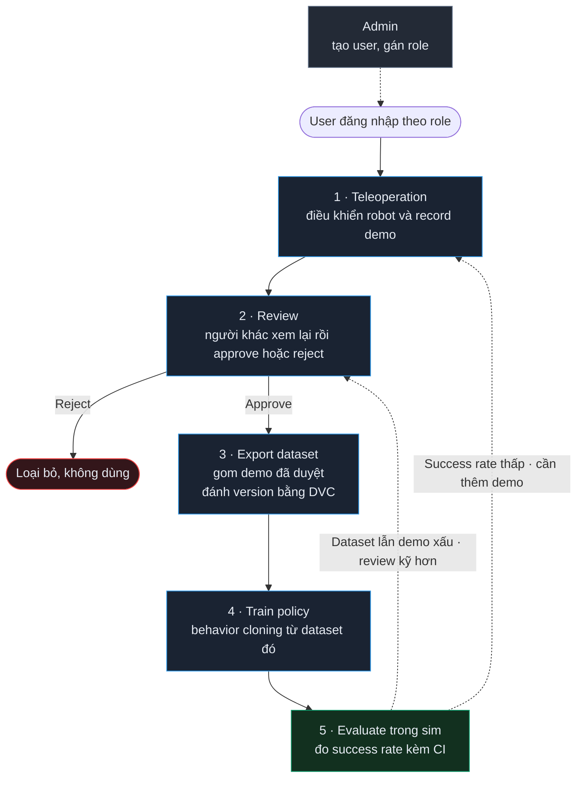
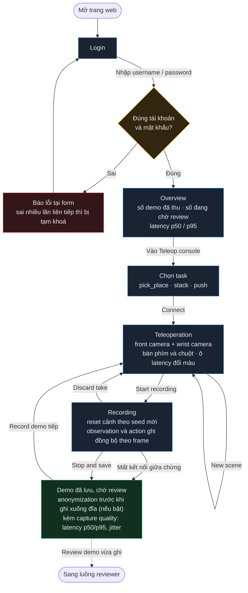
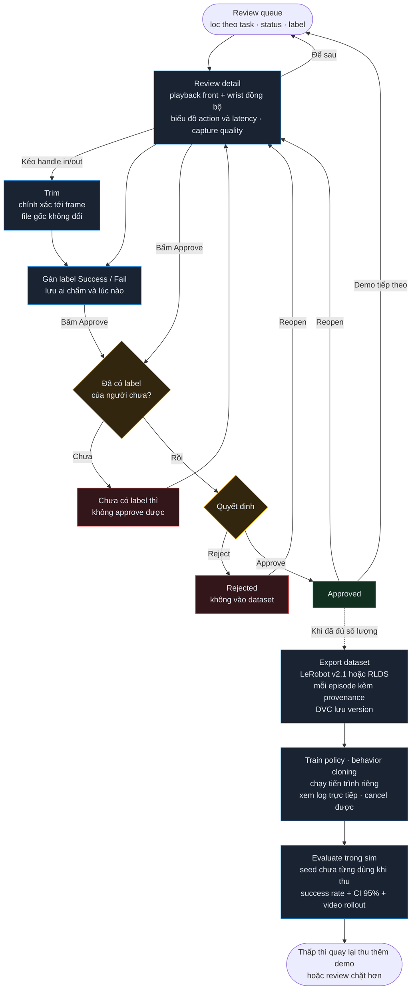

# PHẦN 3: UI FLOW

### 3.1 Overview

```mermaid
flowchart TD
    AD["Admin<br/>tạo user, gán role"] -.-> P
    P(["User đăng nhập theo role"]) --> A["1 · Teleoperation<br/>điều khiển robot và record demo"]
    A --> B["2 · Review<br/>người khác xem lại rồi approve hoặc reject"]
    B -->|"Reject"| X(["Loại bỏ, không dùng"])
    B -->|"Approve"| C["3 · Export dataset<br/>gom demo đã duyệt<br/>đánh version bằng DVC"]
    C --> D["4 · Train policy<br/>behavior cloning từ dataset đó"]
    D --> E["5 · Evaluate trong sim<br/>đo success rate kèm CI"]

    E -.->|"Success rate thấp · cần thêm demo"| A
    E -.->|"Dataset lẫn demo xấu · review kỹ hơn"| B

    classDef step fill:#1a2332,stroke:#2b96e8,color:#e6ebf3
    classDef good fill:#12301f,stroke:#0f9b6c,color:#e6ebf3
    classDef bad fill:#33161a,stroke:#ef4444,color:#e6ebf3
    classDef side fill:#232a36,stroke:#64748b,color:#e6ebf3
    class A,B,C,D step
    class E good
    class X bad
    class AD side
```

### 3.2 Luồng của operator — thu demonstration

```mermaid
flowchart TD
    S(["Mở trang web"]) --> L["Login"]
    L -->|"Nhập username / password"| G{"Đúng tài khoản<br/>và mật khẩu?"}
    G -->|"Sai"| E["Báo lỗi tại form<br/>sai nhiều lần liên tiếp thì bị tạm khoá"]
    E --> L
    G -->|"Đúng"| H["Overview<br/>số demo đã thu · số đang chờ review<br/>latency p50 / p95"]

    H -->|"Vào Teleop console"| T["Chọn task<br/>pick_place · stack · push"]
    T -->|"Connect"| D["Teleoperation<br/>front camera + wrist camera<br/>bàn phím và chuột · ô latency đổi màu"]
    D -->|"New scene"| D

    D -->|"Start recording"| R["Recording<br/>reset cảnh theo seed mới<br/>observation và action ghi đồng bộ theo frame"]
    R -->|"Discard take"| D
    R -->|"Mất kết nối giữa chừng"| K
    R -->|"Stop and save"| K["Demo đã lưu, chờ review<br/>anonymization trước khi ghi xuống đĩa (nếu bật)<br/>kèm capture quality: latency p50/p95, jitter"]

    K -->|"Record demo tiếp"| D
    K -.->|"Review demo vừa ghi"| N(["Sang luồng reviewer"])

    classDef screen fill:#1a2332,stroke:#2b96e8,color:#e6ebf3
    classDef gate fill:#33260f,stroke:#fbbf24,color:#e6ebf3
    classDef bad fill:#33161a,stroke:#ef4444,color:#e6ebf3
    classDef good fill:#12301f,stroke:#0f9b6c,color:#e6ebf3
    class L,H,T,D,R screen
    class G gate
    class E bad
    class K good
```

### 3.3 Luồng của reviewer — review, export, train

```mermaid
flowchart TD
    S(["Review queue<br/>lọc theo task · status · label"]) --> P["Review detail<br/>playback front + wrist đồng bộ<br/>biểu đồ action và latency · capture quality"]
    P -->|"Để sau"| S
    P -->|"Kéo handle in/out"| C["Trim<br/>chính xác tới frame<br/>file gốc không đổi"]
    C --> M["Gán label Success / Fail<br/>lưu ai chấm và lúc nào"]
    P --> M

    P -->|"Bấm Approve"| G{"Đã có label<br/>của người chưa?"}
    M -->|"Bấm Approve"| G
    G -->|"Chưa"| B["Chưa có label thì<br/>không approve được"]
    B --> P
    G -->|"Rồi"| V{"Quyết định"}

    V -->|"Reject"| NO["Rejected<br/>không vào dataset"]
    V -->|"Approve"| Y["Approved"]

    Y -->|"Demo tiếp theo"| S
    Y -->|"Reopen"| P
    NO -->|"Reopen"| P

    Y -.->|"Khi đã đủ số lượng"| EX["Export dataset<br/>LeRobot v2.1 hoặc RLDS<br/>mỗi episode kèm provenance<br/>DVC lưu version"]
    EX --> TR["Train policy · behavior cloning<br/>chạy tiến trình riêng<br/>xem log trực tiếp · cancel được"]
    TR --> RS["Evaluate trong sim<br/>seed chưa từng dùng khi thu<br/>success rate + CI 95% + video rollout"]
    RS --> F(["Thấp thì quay lại thu thêm demo<br/>hoặc review chặt hơn"])

    classDef screen fill:#1a2332,stroke:#2b96e8,color:#e6ebf3
    classDef gate fill:#33260f,stroke:#fbbf24,color:#e6ebf3
    classDef bad fill:#33161a,stroke:#ef4444,color:#e6ebf3
    classDef good fill:#12301f,stroke:#0f9b6c,color:#e6ebf3
    class P,C,M,EX,TR,RS screen
    class G,V gate
    class B,NO bad
    class Y good
```

