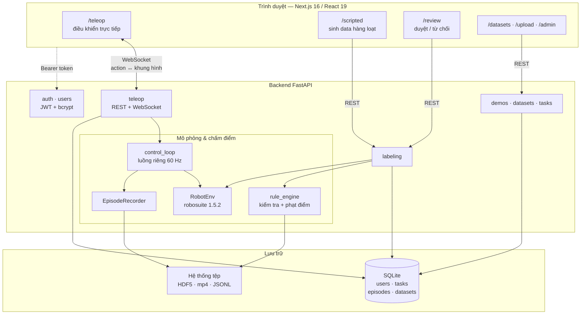
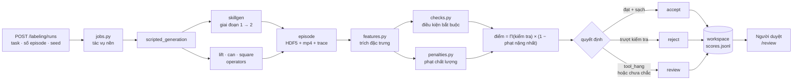
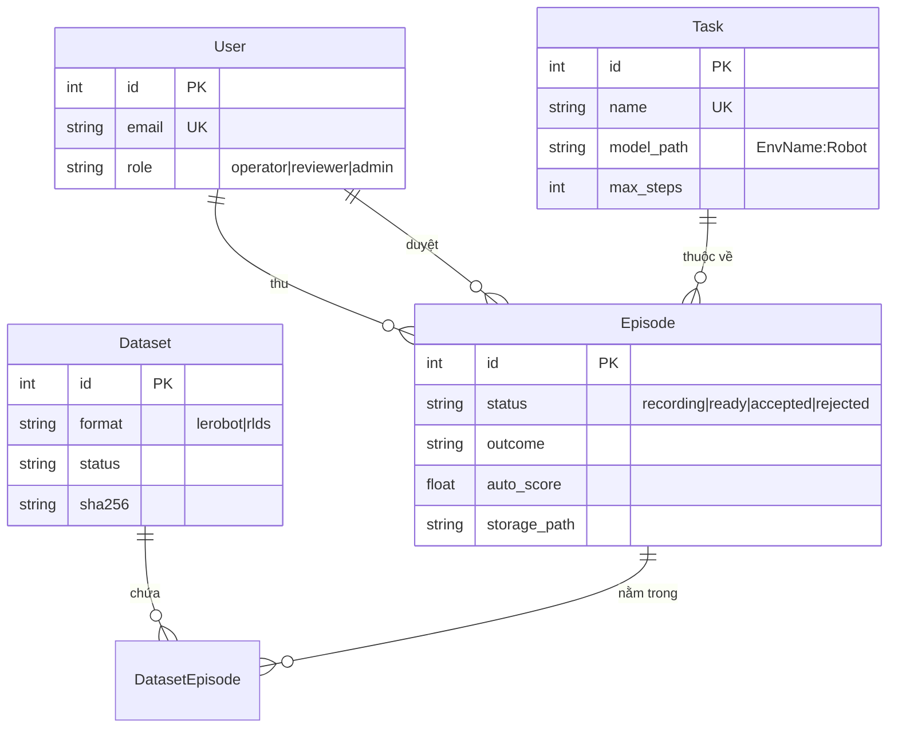

# TeleCollect — Sơ đồ kiến trúc

Nền tảng thu thập dữ liệu trình diễn cho robot: người vận hành điều khiển tay
máy Panda mô phỏng, hoặc một chính sách scripted tự chạy task; mọi episode đều
được ghi lại, chấm điểm tự động, người duyệt xem lại, rồi đóng gói thành
dataset huấn luyện.

Vẽ từ code thực tế trên nhánh `demo-v2`, không phải từ bản kế hoạch.

---

## 1. Tổng quan hệ thống



**Hệ thống không dùng LLM, không vector store, không agent framework.** Phần
"thông minh" ở đây là bộ mô phỏng vật lý cùng tập luật chấm điểm tất định. Tệp
`.env` có sẵn `OPENAI_API_KEY` và `CHROMA_PERSIST_DIR` thừa kế từ template dự
án; không dòng code nào đọc chúng.

---

## 2. Luồng chính — thu demo bằng điều khiển tay

Đây chính là luồng mà video demo trình bày, từ đầu đến cuối.

```mermaid
sequenceDiagram
    actor Op as Người vận hành
    participant UI as TeleopConsole
    participant WS as WebSocket
    participant Loop as Vòng điều khiển
    participant Env as robosuite + MuJoCo
    participant Rec as EpisodeRecorder
    participant Auto as auto_label

    Op->>UI: chọn task, kết nối
    UI->>WS: mở /api/v1/teleop/ws/{session}
    WS->>Loop: khởi động luồng worker
    Loop->>Env: reset(seed) · gắn camera review

    loop mỗi nhịp điều khiển
        Op->>UI: kéo chuột / cuộn / bàn phím / tay cầm
        UI->>WS: action [dx dy dz drx dry drz grip]
        WS->>Loop: đưa action vào hàng đợi
        Loop->>Env: step(action)
        Env-->>Loop: qpos · qvel · ee_pose · 3 khung hình
        Loop-->>WS: trạng thái + ảnh JPEG
        WS-->>UI: vẽ review_front · birdview · wrist
    end

    Op->>UI: Bắt đầu ghi
    Loop->>Rec: ghi (obs, action) mỗi nhịp
    Op->>UI: Dừng & lưu
    Rec->>Rec: xuất HDF5 + mp4 từng camera
    Rec->>Auto: thư mục episode
    Auto-->>UI: accept / reject / review + điểm
```

**Vì sao có ba camera.** `review_front` được gắn vào model lúc chạy bởi
`src/sim/review_camera.py`. Mọi arena của robosuite đều có sẵn `frontview`,
nhưng của ToolHang lại nhìn dọc theo mặt bàn và che mất khung, giá đỡ lẫn cờ
lê. Cùng một góc quay được dùng cho cả lúc điều khiển lẫn lúc xem lại, nên
người vận hành và người duyệt nhìn chung một khung hình.

**Xuất mp4 ngay lúc thu.** Video được ghi trong lúc thu episode chứ không render
khi cần, nên mở trang review không phải chờ.

---

## 3. Sinh data scripted và chấm điểm



**ToolHang luôn trả về `review`.** Bộ metric đánh giá `accept` cho task này đang
được xây dựng: là task hai giai đoạn, nó cần thêm tiêu chí cho chất lượng thao
tác bên cạnh điều kiện thành công. Trong lúc đó, giữ người duyệt trong vòng lặp
vừa bảo đảm không có episode nào vào tập đã duyệt mà chưa ai xem, vừa tích luỹ
dữ liệu để hiệu chỉnh ngưỡng. Đây là bước có chủ đích trong lộ trình, không phải
lỗ hổng của pipeline.

**Lỗi chấm điểm đã biết.** `wandering_path` chấm theo tương quan trong lô thay
vì so với ngưỡng tuyệt đối, nên cùng một episode đem chấm ở hai lô khác nhau sẽ
ra hai điểm khác nhau — nó bắn ở mức 0.9987 trên lô hỗn hợp và kéo `auto_score`
xuống 0.001253. Đã hoãn xử lý, ghi lại trong `docs/DATA_QUALITY.md`.

---

## 4. Mô hình dữ liệu



---

## 5. Thành phần

| Tầng | Công nghệ | Vị trí |
|---|---|---|
| Giao diện | Next.js 16, React 19, TypeScript 5.8, Tailwind | `frontend/` |
| API | FastAPI, Pydantic v2 | `src/api/` |
| Thời gian thực | WebSocket, mỗi phiên một luồng worker | `src/core/control_loop.py` |
| Vật lý | robosuite 1.5.2 trên MuJoCo 3.8.1 | `src/sim/` |
| Kỹ năng ToolHang | vendor sẵn, hai giai đoạn | `src/sim/skillgen/` |
| Ghi dữ liệu | HDF5 (chuẩn robomimic) + mp4 | `src/core/recorder.py` |
| Chấm điểm | kiểm tra và phạt điểm tất định | `src/labeling/` |
| Cơ sở dữ liệu | SQLite qua SQLAlchemy 2 async, Alembic | `src/models/db.py` |
| Xác thực | JWT access + refresh, bcrypt | `src/services/security.py` |
| Xuất dữ liệu | LeRobot, RLDS | `src/export/` |

### Danh sách task

Cả bốn task đều chạy qua cùng một pipeline: thu được bằng scripted lẫn teleop,
và đều được auto-label bởi `src/services/auto_label.py`. Khác biệt nằm ở nhãn
mà chúng có thể nhận.

| Task | Môi trường | Nhãn tự động có thể nhận |
|---|---|---|
| `lift` | robosuite Lift | `accept` · `review` · `reject` |
| `pick_place_can` | robosuite PickPlaceCan | `accept` · `review` · `reject` |
| `nut_assembly_square` | robosuite NutAssemblySquare | `accept` · `review` · `reject` |
| `tool_hang` | skillgen vendor sẵn, giai đoạn 1 + 2 | `review` · `reject` |

`tool_hang` hiện đang trong giai đoạn **xây dựng bộ metric đánh giá `accept`**.
Là task hai giai đoạn phức tạp nhất trong bốn task, nó cần thêm các tiêu chí
riêng cho chất lượng thao tác — cắm khung có dứt khoát không, treo cờ lê có
trúng móc không — nên trước mắt mọi episode không thất bại rõ ràng đều chuyển
cho người duyệt. Dữ liệu người duyệt tạo ra ở bước này chính là cơ sở để hiệu
chỉnh ngưỡng cho luật `accept` tự động.

Cơ chế tương tự cũng áp dụng cho `lift`: episode thành công nhưng chưa đánh giá
được chất lượng nắm thì đẩy sang `review` thay vì `accept`.
